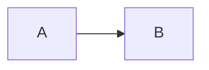

:smirk:
# This is h1 
## This is h2 
### This is h3
****
**This is strong**
这是tmd中文

*This is italic*
****
text...
****
$\lambda(x)=x^x$

$$
f(x)=g
$$

`int c=0;`

```c
int a,b;
```

  ```python
  import this
  class x:
      def __init__():
          pass
  ```


|  A  |  B  |
|-----|-----|
| a0  | b0  |
| a1  | b1  |

>This is reference

```music
X:1
T:alternate heads
M:C
L:1/8
U:n=!style=normal!
K:C treble style=rhythm
"Am" BBBB B2 B>B | "Dm" B2 B/B/B "C" B4 |"Am" B2 nGnB B2 nGnA | "Dm" nDB/B/ nDB/B/ "C" nCB/B/ nCB/B/ |B8| B0 B0 B0 B0 |]
%%text This translates to:
[M:C][K:style=normal]
[A,EAce][A,EAce][A,EAce][A,EAce] [A,EAce]2 [A,EAce]>[A,EAce] |[DAdf]2 [DAdf]/[DAdf]/[DAdf] [CEGce]4 |[A,EAce]2 GA [A,EAce] GA |D[DAdf]/[DAdf]/ D[DAdf]/[DAdf]/ C [CEGce]/[CEGce]/ C[CEGce]/[CEGce]/ |[CEGce]8 | [CEGce]2 [CEGce]2 [CEGce]2 [CEGce]2 |]
GAB2 !style=harmonic![gb]4|GAB2 [K: style=harmonic]gbgb|
[K: style=x]
C/A,/ C/C/E C/zz2|
w:Rock-y did-nt like that
```

```echarts
{
"option": {
        "xAxis": {
            "type": "category",
            "data": ["Mon","Tue","Wed","Thu","Fri","Sat","Sun"]
        },
        "yAxis": {
            "type": "value"
        },
        "series": [
            {
                "data": [820,932,901,934,1290,1330,1320],
                "type": "line"
            }
        ]
    }
}
```