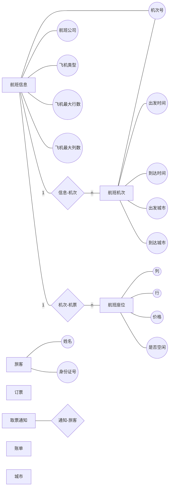
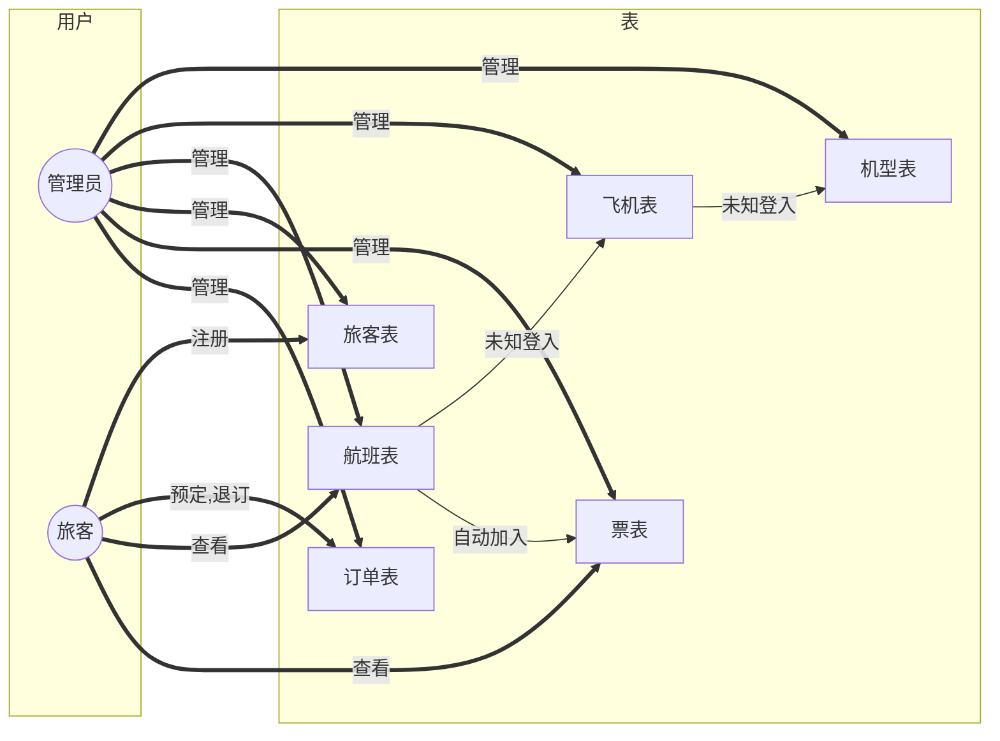

# 机票预订系统




```sql
drop database if exists airticket_booking;
create database airticket_booking;
use airticket_booking;
```


机型aircraft_type

| 飞机型号id | 行数col | 列数line |
| ---------- | ------- | -------- |
| char(20)   | int     | int      |
| pk         |         |          |

```sql
create table aircraft_type(id char(20) not null, col int not null, line int not null, name char(20),constraint pk_aircraft_type primary key(id));
```


飞机aircraft

| 飞机号id | 所属公司company | 飞机型号atid | 飞机名name |
| -------- | --------------- | ------------ | ---------- |
| int      | char(20)        | char(20)     | char(20)   |
| pk       |                 | aircraft(id) |            |

```sql
create table aircraft(id int not null auto_increment, company char(20) not null, atid char(20) not null, name char(20) not null, constraint pk_aircraft primary key(id), constraint fk_aircraft_atid foreign key(atid) references aircraft_type(id));
```


机场airport

| 机场号名id | 飞机场名airport_name | 城市名city_name | 省名province_name |
| ---------- | -------------------- | --------------- | ----------------- |
| int        | char(20)             | char(20)        | char(20)          |
| pk         |                      |                 |                   |

```sql
create table airport(id char(20) not null, city_name char(20) not null, province_name char(10), constraint pk_airport primary key(id));
```


航班flight

| 航班号id | 始发机场ID d_apid | 达到机场ID a_apid | 始发时间d_time | 到达时间a_time | 飞机号aid    |
| -------- | ----------------- | ----------------- | -------------- | -------------- | ------------ |
| int      | int               | int               | datetime       | datetime       | int          |
| pk       | airport(id)       | airport(id)       |                |                | aircraft(id) |

```sql
create table flight(id int not null auto_increment, d_apid char(20) not null, a_apid char(20) not null, d_time datetime not null, a_time datetime not null, aid int not null, constraint pk_flight primary key(id),constraint fk_flight_d_apid foreign key(d_apid) references airport(id), constraint fk_flight_a_apid foreign key(a_apid) references airport(id), constraint fk_flight_aid foreign key(aid) references aircraft(id));
```


```sql
create table flight(id int not null auto_increment,d_apid char(20) not null,a_apid char(20) not null,d_time datetime not null,a_time datetime not null,aid int not null,constraint pk_flight primary key(id),constraint fk_flight_d_apid foreign key(d_airport_id) references airport(id),constraint fk_flight_a_apid foreign key(a_airport_id) references airport(id),constraint fk_flight_aid foreign key(aid) references aircraft(id));
```


票ticket

座位号 A14  列号+行号


| 票号id | 航班号fid  | 列号col_ind | 行号line_ind | 状态state                                       | 价格price |
| ------ | ---------- | ----------- | ------------ | ----------------------------------------------- | --------- |
| int    | int        | int         | int          | int                                             | float     |
| pk     | flight(id) |             |              | 状态(0:空闲  1:预定  2：取票付款 3：未取票付款) |           |


```sql
create table ticket(id int not null auto_increment, fid int not null, sid char(5) not null, price float not null, constraint pk_ticket primary key(id), constraint fk_ticket_fid foreign key(fid) references flight(id),check(state>=0 and state<=3));
```


旅客passager

| 旅客身份证号id | 姓last_name | 名first_name | 邮箱email | 电话phone | 密码pwd  |
| -------------- | ----------- | ------------ | --------- | --------- | -------- |
| char(18)       | char(10)    | char(10)     | char(30)  | char(11)  | char(20) |
| pk             |             |              |           |           |          |
```sql
create table passager(
id char(18) not null,
last_name char(10) not null,
first_name char(10) not null,
phone char(11) not null,
email char(30) not null,
pwd   char(20) not null,
constraint pk_passager primary key(id));
)
```


订单booking

| 订单id | 旅客pid      | 票号tid    |
| ------ | ------------ | ---------- |
| int    | int          | int        |
| pk     | passager(id) | ticket(id) |

```sql
create table booking(id int not null auto_increment, pid int not null, tid int not null, constraint pk_booking primary key(id), constraint fk_booking_pid foreign key(pid) references  passager(id), constraint fk_booking_tid foreign key(tid) references ticket(id));
```


取票collect_ticket (view)

| 订单id | 旅客pid      | 票号tid                      | 取票时间ct_time |
| ------ | ------------ | ---------------------------- | --------------- |
| int    | int          | int                          | datetime        |
| pk     | passager(id) | ticket(id)所有预定状态可取票 |                 |

```sql
create view collect_ticket as select B.id as id, B.pid as pid, T.id as tid, date_sub(F.d_time, interval 1 day) as ct_time from booking as B, ticket as T, flight as F where B.tid=T.id and T.fid = F.id;
```

```sql
create view collect_ticket as select B.id as id, B.pid as pid, T.id as tid, date_sub(F.d_time, interval 1 day) as ct_time from booking as B, ticket as T, flight a s F where B.tid=T.id and T.fid=F.id;
```


账单bill (View)

| 订单号id | 价格price | 公司名company | 航班名fname | 票号tid | 座位号sid |
| -------- | --------- | ------------- | ----------- | ------- | --------- |
| int      | float     | char(20)      | char(20)    | int     | char(5)   |
| pk       |           |               |             |         |           |

```sql
create view bill as select B.id as bid, T.price as price, A.company as company, A.name as fname, T.id as tid, T.sid as sid from booking as B, flight as F, aircraft as A, ticket as T where B.tid=T.id and T.fid=F.id and F.aid=A.id;
```

```sql
create view bill as select B.id as bid, T.price as price, A.company as company, A.name as fname, T.id as tid, T.sid as sid from booking as B, flight as F, aircraft as A, ticket as T where B.tid=T.id and T.fid=F.id, F.aid=A.id;
```


插入基本数据

```sql
insert into aircraft_type(id, col, line, name) values (1, 6, 20, "波音727"),(2,8,30,"波音737"),(3,6,24,"波音747");
insert into aircraft(id, company, atid, name) values (1, "东方航空", 1, "A101"),(2,"东方航空",2,"A102"),(3,"南方航空",2,"Z11"),(4,"南方航空",3,"Z12");
insert into flight(id, d_apid, a_apid, d_time, a_time, aid) values(1,10,11,"2021-01-01 00:00:00","2021-01-01 08:00:00", 1);
```




