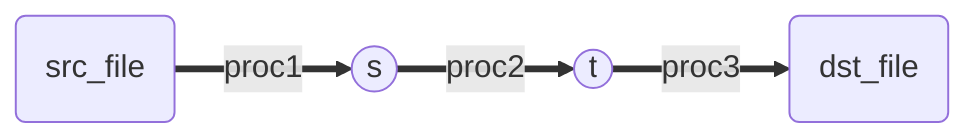
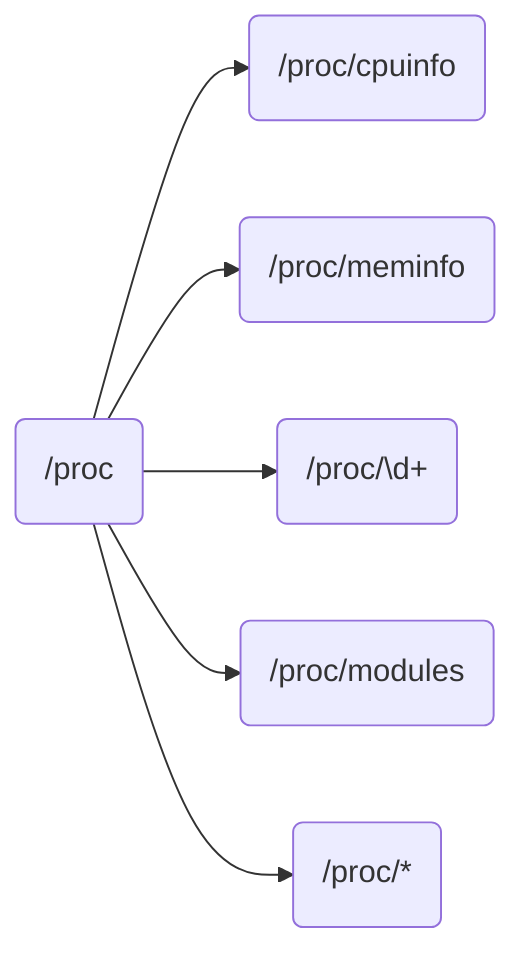
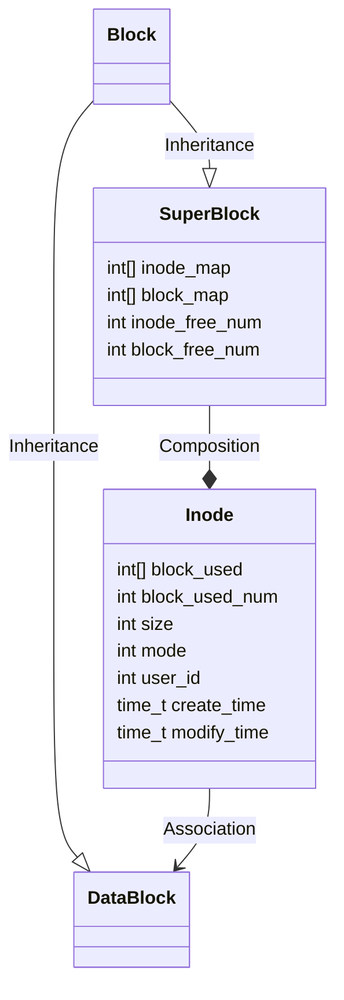
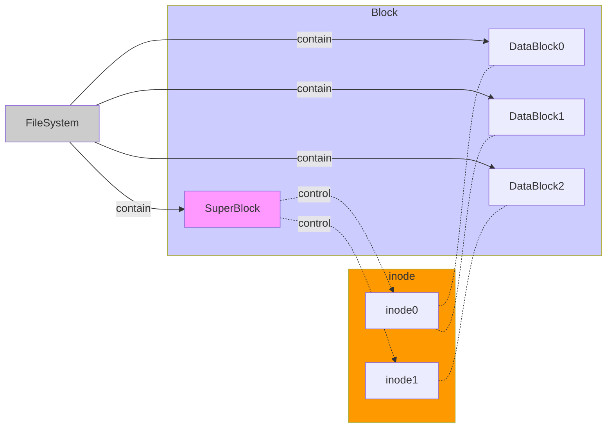

# 操作系统实验

# 0.环境配置

## 0.1 操作系统介绍

**WSL2**(*Windows Subsystem for Linux*)

WSL是一个跑在windows指令集上的指令集，没有Linux内核，而WSL2是一个真正的虚拟机。WSL2和任何虚拟机都互斥。

**需要注意的是**

- WSL是没有kernel的，如果要仅需进行实验，请将WSL升级为WSL2
- 由于后期下载包很大，为了加速可以对apt进行换源
- WSL2是没有图形界面的，可以后续安装轻量级界面xfce4

## 0.2 WSL2启用

- 确定windows 版本为2004及以上，可以通过[易升](https://download.microsoft.com/download/8/3/c/83c39dca-2d27-4c24-b98b-0a4d6d921c80/Windows10Upgrade9252.exe)进行升级

- 启用WSL功能

  在 CMD(管理员) 中执行

  ```
  dism.exe /online /enable-feature /featurename:Microsoft-Windows-Subsystem-Linux /all /norestart
  ```

  - 开启虚拟机特征

  ```
  dism.exe /online /enable-feature /featurename:VirtualMachinePlatform /all /norestart
  ```

- 下载安装Linux内核

  - [x64](https://wslstorestorage.blob.core.windows.net/wslblob/wsl_update_x64.msi)
  - [ARM64](https://wslstorestorage.blob.core.windows.net/wslblob/wsl_update_arm64.msi)

- 在应用商店安装linux发行版本(如果之前安装过可以不用)

- WSL 升级到WSL2

  在CMD(管理员)中执行

  ```cmd
  wsl --set-default-version 2
  wsl --set-version Ubuntu 2
  ```

- 检查版本

  ```cmd
  wsl -l -v
  
  ```

## 0.3 换源apt

- 查看ubuntu 版本
  **敲黑板，注意版本，不然下载会出现包损坏的情况 **
  找到版本, 这里的*Codename*是*focal*

  ```bash
  lsb_release -a
  ```

  ```
  No LSB modules are available.
  Distributor ID: Ubuntu
  Description:    Ubuntu 20.04.1 LTS
  Release:        20.04
  Codename:       focal
  ```

- 根据相关ubuntu版本找到国内源
  将*/etc/apt/sources.list*中文件替换为国内相应的源（这里是阿里源focal），一定要对应版本，不然会有包依赖损坏

  ```bash
  touch sources.aliyun
  echo "
  deb http://mirrors.aliyun.com/ubuntu/ focal main restricted universe multiverse
  deb-src http://mirrors.aliyun.com/ubuntu/ focal main restricted universe multiverse
  deb http://mirrors.aliyun.com/ubuntu/ focal-security main restricted universe multiverse
  deb-src http://mirrors.aliyun.com/ubuntu/ focal-security main restricted universe multiverse
  deb http://mirrors.aliyun.com/ubuntu/ focal-updates main restricted universe multiverse
  deb-src http://mirrors.aliyun.com/ubuntu/ focal-updates main restricted universe multiverse
  deb http://mirrors.aliyun.com/ubuntu/ focal-proposed main restricted universe multiverse
  deb-src http://mirrors.aliyun.com/ubuntu/ focal-proposed main restricted universe multiverse
  deb http://mirrors.aliyun.com/ubuntu/ focal-backports main restricted universe multiverse
  deb-src http://mirrors.aliyun.com/ubuntu/ focal-backports main restricted universe multiverse
  ">>sources.aliyun
  sudo cat sources.aliyun > /etc/apt/sources.list
  ```

## 0.4 安装图形化界面

- 下载xfce4

	```bash
	sudo apt-get install xfce4-terminal
	sudo apt-get install xfce4
	```
- 安装中文字体

	```bash
	sudo apt-get install ttf-wqy-zenhei
	```
- 配置环境
	在windows中使用$ipconfig$指令来查看WSL2的IP
	
	```sh
	> ipconfig
	```
	在WSL2中的*~\.bashrc​*中配置IP
	```bash
	export DISPLAY=172.18.112.1:0 #这里改成WSL2的IP
	```
	更新WSL2
	```bash
	source ~/.bashrc
	```
- windows XLaunch
    - windows[下载安装xcvsrv](https://sourceforge.net/projects/vcxsrv/)
    - windows 打开XLaunch

- 打开图形界面
	先运行WSL2中命令，再打开界面
	```bash
	startxfce4
	```
	打开Xlaunch 的时候 Disable access control**一定需要勾选**
	
## 0.5 安装GTK2.0

因为网上的GTK3.0的教程太少了，实验时间也紧，所以换成了GTK2.0
GTK2.0并QT小太多了，如果仅仅做实验的话建议安装GTK

- 安装GNU编译链接工具

	```bash
	sudo apt-get install build-essential
	```
- 安装gtk

	```bash
	sudo apt-get install libgtk-3-dev
	```

- 自动查找gtk头文件

	```bash
	sudo apt-get install pkg-config
	```
	
	
# 1.任务一：多进程和GTK的使用

## 1.1 实验要求
- 誊抄程序

	编一个C程序，其内容为实现文件拷贝的功能。基本要求：使用系统调用open/read/write...
	选择：容错、cp
- GTK实现多窗口应用

    编一个C程序，其内容为分窗口同时显示三个并发进程的运行结果。要求用到Linux下的图形库。 (gtk/Qt) 
    基本要求：三个独立子进程，各自窗口显示；
    选择：三个进程誊抄演示

## 1.2 实现原理

- 誊抄程序

	进程1从$src\_file$中循环读取字符串存入$s$,进程2循环从$s$中读取内容存入$t$,进程3循环从$t$中读取字符串写入$dst\_file$。进程间通过管道进行通信。



- GTK实现多窗口应用

	main文件连续调用三次$execv$函数分别执行$fibo(运算斐波那契数列),acc(输出\#),time(显示当前时间)$三个进程

	```mermaid
	graph LR
		m(main)
		f>fibo]
		a>acc]
		t>time]
		m--execv-->f
		m--execv-->a
		m--execv-->t
  ```
## 1.3 效果展示
- 誊抄程序

  

- GTK实现多窗口应用

  

## 1.4 实验心得

- 进程间通信一般可以通过$share\_memory$和$pipe$来进行通信，但是在通信的时候，有些变量还是需要使用信号灯来管理

- GTK3.0的中文资料和博客太少了，网上的GTK博客全是2015年以前的。如果学校希望我们使用GTK的话，希望能提供给我们学习路线，GTK的学习成本太高了

- WSL2安装图形化界面后，在windows中可以通过xlaunch进行连接显示，但是每次都需要在WSL2的*~\.bashrc*中进行修改，之前试了试网上自动化的方法，但是都没有work。

- apt换源的时候，一定要注意Ubuntu的版本，不同版本的包之间不兼容，会出现包错误的情况，这个时候请检查版本并重新更新apt源


# 2.任务二：新增系统调用

## 2.1 实验要求

掌握系统调用的实现过程，通过编译内核方法，增加一个新的系统调用。另编写一个应用程序，使用新增加的系统调用。
(1) 内核编译、生成，用新内核启动；
(2) 新增系统调用实现：文件拷贝或P、V操作。

## 2.2 实验原理

## 2.3 实验流程

### 2.3.1 准备

- 至少需要30G存储空间。wsl默在c盘，如果空间不够可以考虑 [wsl 迁移](https://cloud.tencent.com/developer/article/1594940)

- [下载内核](https://www.kernel.org/)到$/usr/src/$

查看内核版本，下载相近版本(前向兼容)

```
cat /proc/version
```

- 解压

```bash
xz -d linux-5.4.102.tar.xz
tar -xvf /usr/src/linux-5.4.102.tar
```

- 下载必要包

```bash
apt-get install libncurses5-dev
apt-get install libssl-dev
apt-get install libelf-dev
```

  


### 2.3.2 编写功能代码

- 系统函数文件$/usr/src/linux-5.4.102/kernel/sys.c$

**注意**
- printk输出使用dmesg观察
- 是否加`__x64_`取决于tbl文件中的格式

```c
/*
printk 是kernel函数，在sys.c中有些函数不能使用，必须使用kernel函数, printk不会直接输出到stdout中，在命令行中输入dmesg可以观察到printk的输出
*/
asmlinkage long __x64_sys_chiTest(void){
printk("This is a test of walker chi!\n");
return 1;
}
```

- 头文件$/usr/src/linux-5.4.102/arch/x86/include/asm/syscalls.h$

```c
asmlinkage long __x64_sys_chiTest(void);
```

- 系统调用表$/usr/src/linux-5.11.2/arch/x86/entry/syscalls/syscall\_64.tbl$

调用号不能与表中的其他调用号重复， $chicall$是调用

```
437	common		chicall		__x64_sys_chiTest
```

- (可省略)系统调用头文件$/usr/include/asm-generic/unistd.h$

调用号要和系统调用表中一致

```c
#define __NR_chiTest 437
__SYSYCALL(__NR_chiTest, __x64_sys_chiTest)
```

  


### 2.3.3 编译内核

- (可省略)清理次残存文件(*如果不是第一次编译*)

保证在$/usr/src/linux-5.4.102$文件夹下

```bash
make mrproper
make clean
```

- 配置内核

wsl2内核[x64](https://github.com/microsoft/WSL2-Linux-Kernel/raw/master/Microsoft/config-wsl)配置和[arm64](https://github.com/microsoft/WSL2-Linux-Kernel/raw/master/Microsoft/config-wsl-arm64)配置

放入$/usr/src/linux-5.4.102/.config$

修改$/usr/src/linux-5.4.102/Makefile$
```shell
EXTRAVERSION = Walktu
```

修改$/usr/src/linux-5.4.102/.config$
```shell
CONFIG_LOCALVERSION="walktu"
```

- 编译内核

ccache加速(ssd缓存)

```bash
apt-get install ccache
vim ~/.bashrc
export USE_CCACHE=1
export CC="ccache gcc"
export CXX="ccache g++"
export PATH="/usr/lib/ccache:$PATH"
source ~/.bashrc
ccache -M 32G
```

[tmpfs加速(RAM缓存)](https://blog.csdn.net/lvliang2008/article/details/8648981)


$make = \begin{cases} make~bzImage\\make~modules\end{cases}$

$jN$使用$N$核编译

```bash
make -j8
```

### 2.3.4 安装内核

```bash
make modules_install -j8
make install -j8
```

- windows 关闭WSL2

```bash
wsl --shutdown
```

- 在windows中替换WSL2 kernel

用*\\wsl$\usr\src\linux-5.4.102\arch\x86\boot\bzImage*文件替换*C:\Windows\System32\lxss\tools\kernel*文件


### 2.3.5 检查

- 检查内核版本

```bash
uname -r
```

- 检查系统调用

```c
#include<stdio.h>
#include<linux/unistd.h>
#include<asm/unistd.h>

int main(int argc,char **argv){
    int i=syscall(437);
    if (i==1)
      printf("succeed!\n");
    else
      printf("failed!\n");
    return 1;
}
```
在命令行中输入$dmesg$,如果出现$This~is~a~test~of~walker~chi!$则成功

## 2.4 效果展示


## 2.5 实验心得

- 一定要使用WSL2, WSL是没有kernel的, 不是真正的虚拟机, 没有内存, WSL2才是真正的虚拟机

- 编译内核时一定要使用加速方法，否则编译奇慢，加速后可以达到几分钟以内完成编译

- 新增加的系统调用一定使用kernel函数，不要使用用户函数，因为用户函数在这个阶段还没有包装好


# 3.任务三：新增设备驱动

## 3.1 实验要求

掌握增加设备驱动程序的方法。通过模块方法，增加一个新的字符设备驱动程序，其功能可以简单,基于内核缓冲区。
	基本要求：演示实现字符设备读、写；
    选择：键盘缓冲区，不同进程、追加、读取

## 3.2 实验原理

Linux系统使用文件来模拟一切，因此设备也可以用文件进行模拟

对于一个设备驱动，需要实现 *_\_init, __exit, _open, _release, _read, _write, _llseek, _ioctl*等方法即可

## 3.3 实验流程

### 3.3.1 编写设备代码

实现模块函数$chi\_dev.c$

编译$chi\_dev.c$
```
KVERS :=$(shell uname -r)
PWD :=$(shell pwd)
make -C /lib/modules/$(KVERS)/build M=$(PWD) modules
```

### 3.3.2 安装模块

```
sudo insmod chi_dev.ko
```

### 3.3.3 设置权限

```
sudo chmod 777 /dev/chidriver
```

### 3.3.4 查看信息

查看所有安装模块
```
lsmod
```

查看chi_dev信息
```
modinfo chi_dev.ko
```

### 3.3.5 验证
编写$test.c$文件, 对chidriver进行操作, 代码见附录

## 3.4 效果展示

安装模块，中间有很多$warning$，不过可以忽略


编译test文件进行测试


## 3.5 实验心得

- 如果chidriver不能访问，一般是权限不够，因此设置chidirver的权限可以解决该问题

- 在WSL2上与VMware上不同, WSL2中的原来安装模块是空的，因此非常容易辨别是否添加了模块

- 模块的*_\_init*方法只会在安装的时候执行一次，而*_open*方法会在每次打开时都执行，弄清楚每个函数在什么时候执行的才能让测试程序不出bug。

# 4.任务四：使用GTK实现系统监控器

## 4.1 实验要求

使用GTK/QT实现系统监控器
了解/proc文件的特点和使用方法；
监控系统中进程运行情况；
用图形界面实现系统资源的监控。

## 4.2 实验原理

CPU信息，RAM信息，进程信息等等在linux中都用文件来进行表示，这些文件在/proc文件目录下

CPU使用率等信息可以在$/proc/cpuinfo$下查询得到；RAM使用信息可以在/proc/meminfo下查询得到；进程信息可以$/proc$文件夹下所有数字命名的文件夹，数字为进程号，可以用$ps ~aux$进行查询；模块信息可以在$/proc/modules$下查询



## 4.3 效果展示


因为在实验三中安装了自己编写的模块，会因此出现新加入的模块


观察$/proc$文件夹


## 4.4 实验心得

- 首先要弄清楚$/proc$文件夹下每个文件的信息，对这些信息进行字符串处理比较简单。对于窗口程序，从零开始撸会感觉到浪费生命，可以直接用现有的进行定制修改。

- 与VMware不同, WSL2的modules文件夹下很干净，只有之前实验三安装的模块

# 5.任务五：小型文件系统

## 5.1 实验要求

设计并实现一个模拟的文件系统
(1)基于一大文件(10M或100M)，模拟磁盘；
(2)格式化，建立文件系统管理数据结构；
(2)基本操作，实现文件、目录相关操作。
选择：实现图形界面操作。

## 5.2 实验原理

整个文件系统可以看做是对一个超大文件的分块管理，每一个块$Block$可以存放$SuperBlock$或者$DataBlock$

- $SuperBlock$

  $SuperBlock$有且仅有一个，用于控制全局的$inode$，$SuperBlock$存储在文件的第一个$Block$中。	

  - $inode\_map$存放inode是否被分配的bitmap,已分配为1,未分配为0, 使用循环进行遍历查询
  - $block\_map$存放$DataBlock$是否被分配的bitmap, 已分配为1, 未分配为0, 使用循环进行遍历


- $Inode$

  $Inode$是每个文件/文件夹的信息头，包括了对文件使用$Block$的描述以及对于文件的权限

  - $block\_used$存放inode使用到的$DataBlock$的编号
  - $mode$辨识$inode$是文件还是文件夹，以及用户权限
  - $size$实际使用字节大小, 如果是文件类型，初始化为0，如果是文件夹类型初始化为两个链接大小, 因为每个文件夹默认包含'.'和'..'

- $DataBlock$

  用于存储数据二进制数据





## 5.3 效果展示

在$/home/hi$文件中写入$welcom~to~walker\_fs$


## 5.4 实验心得

- Linux文件系统确实非常复杂，在有限的时间内只能实现简单的阉割版本，基本的空闲块管理也是通过遍历来获取的，但是这样的效率很低。
- 除了基本的$Block$管理，还有一些交互命令比较难实现，例如上下键切换之类的，交互的便捷才是Linux文件系统的精髓


