<h1>
    <span style="text-decoration:line-through;display:inline-box">ICS PA 2019</span>
    <span>HUST PA</span>
</h1>

****
$walkerchi\cdot 2022-1-9$
****
照着NJU-PA做就好，[感谢汪先奇奆佬手把手入门教程](https://zhuanlan.zhihu.com/p/413911195)，整个过程非常折磨，有的时候为了实现一个简单的功能可以反汇编跟踪到了13层函数调用(没错，就是printf)。 有些库函数注释都是上个世纪70年代的，实现过程复杂繁琐，非常多无用功，源代码改进空间还是很大的。这个项目主要还是告诉我们整个计算机系统如何运行，所以过分纠结代码风格会给人带来无穷的痛苦:broken_heart:。跟我一同过来交换的其他学院同学都在德国法国荷兰玩，而我把自己关在家里写PA :shit:。这个Project教导我最多的不是计算机，而是如何心平气和处事:pray:。定乎内外之分，辩护荣辱之境，如空无象，湛然圆满。


****
## 0.PA0 环境配置
这个项目在 WSL2 Ubuntu20.04 上完成，会遇到很多坑，毕竟WSL不是真正的虚拟机。
### 0.0克隆仓库
这一步在校外的同学需要通过学校VPN链接。
在做PA时我人在德国，幸好之前为了做科研办过VPN，现在就方便一些。
```
git clone https://course.cunok.cn/pa/ics2019_1.git/
```
在阅读Makefile源代码后我们可以发现在每次make后都会自动更新到git仓库，十分方便。但同时这也意味着Makefile错综复杂，牵一发而动全身。
### 0.1配置环境变量
```bash
export STUID=UXXXXXXXXX              #学号，用于提交
export STUNAME=XXX                   #姓名，用于提交
export ICS_HOME=./ics2019            #ics2019 根目录位置，方便修改目录位置
export NANO_HOME=ICS_HOME/nanos-lite #nanos-lite 简易操作系统 文件夹位置
export NAVY_HOME=ICS_HOME/navy-apps  #navy-apps 运行软件 文件夹爱位置
export NEMU_HOME=ICS_HOME/nemu       #nemu 简易指令集 文件夹位置
export AM_HOME=ICS_HOME/nexus-am     #nexus-am 简易裸机 文件夹位置 
```
建议写在**~/.bashrc**中

## 1.PA1 NEMU入门

### 1.1.简易调试器

这里只用简单阅读一下 `nemu/src/monitor/debug/*` 的代码并补全就好。

不过在`info r`指令中需要用到 `nemu/src/isa/riscv32/reg.c`中的`isa_reg_display`函数，这个函数得自己补全。

这个后面好像没怎么用到，可能是我打开的方式不对:sweat_smile:

最难的莫过于p的实现，考验一些编译原理，简单的表达式可以使用逆波兰式的求解方法，但是这个需要支持寄存器与指针访问，所以不同，必须按照文档上使用递归求解。

|   命令   |            说明             |
| :------: | :-------------------------: |
|   help   |            帮助             |
|    c     |          继续运行           |
|    q     |            退出             |
|  si [N]  |    单步执行N步，默认为1     |
| info r/w |    打印寄存器/监视点信息    |
|  p EXPR  |      求出表达式EXPR值       |
| x N EXPR | 从EXPR开始打印内存N个字长值 |
|   d N    |     删除序号为N的监视点     |
|  w EXPR  |   当EXPR为true时程序暂停    |

### 1.2.测试
`nemu/`目录下
`make ISA=$ISA run`

### 1.3.注意事项
0. 学会阅读Makefile，在做PA1、PA2的时候后，我遇到的大部分是Makefile报错，由于之前没有注意在意语言，所以花了很多功夫来学习Makefile.(:sweat_smile:论一个有包管理器和项目管理器语言的重要性，这里推荐RUST、GO、JS，Python就算了，比同为动态语言的JS效率低到不知道哪里去了，除非你numba或者cython很溜，希望华科以后出一个更friendly一点的完爆南大)
1. 第一次make会遇到包未安装的情况，按照google上一项一项解决就好了
2. RTFM **R**ead **T**he **F**ucking **M**anual 很多关键问题文档上一带而过，然后放一句RTFM让人读手册，给我TM整无语了:sweat_smile:，多说两句话又不是少几年寿命。
****

## 2.PA2 NEMU+NEXUS-AM

这个就是实打实的实现RISCV32了，逐渐开始硬核。因为C没有接口（虚类、虚函数），所以需要通过一系列让我我开眼的宏定义来达到类似的效果。

这里说一下主要的运行流程。`nemu/src/monitor/monitor.c`中的`cpu_exec`调用了`nemu/src/cpu/cpu.c`中的`exec_once`，这个函数又调用了`nemu/src/isa/riscv32/exec/exec.c`中的`void isa_exec(vaddr_t *pc)`,  该函数中的主要执行函数`static inline void idex(vaddr_t *pc, OpcodeEntry *e)`和宏`IDEX`都定义在`nemu/include/cpu/exec.h`中。

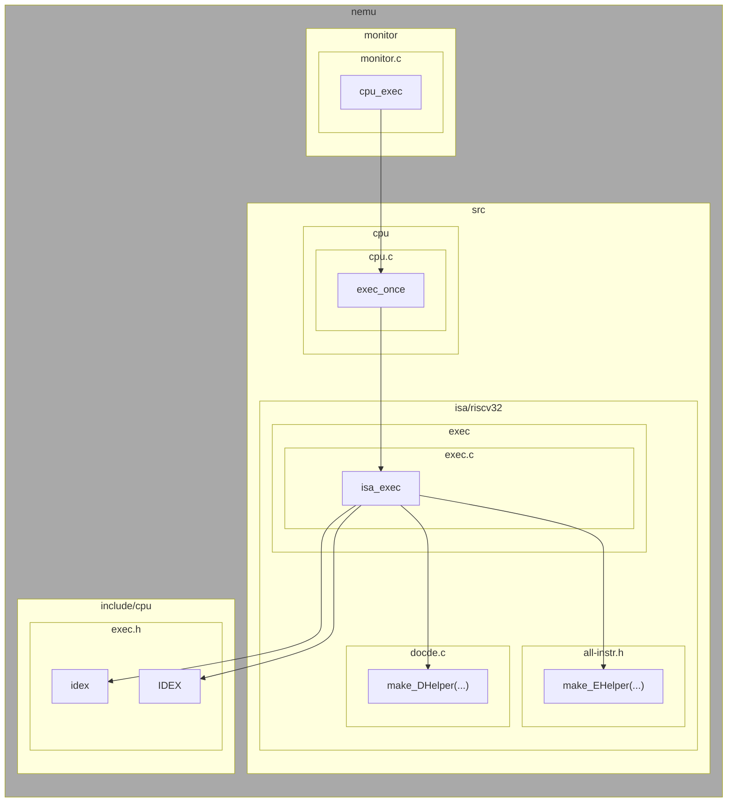


取址阶段已经在`void isa_exec(vaddr_t *pc)`中帮我们实现好了，我们只需要实现所有指令的译码和执行就可以了。为了使用我们在译码和执行定义的函数，我们也需要对`nemu/src/isa/riscv32/exec/exec.c`中的分发也就是`static OpcodeEntry opcode_table`进行修改

这里放上所有需要实现的指令以供参考。


### 2.1.ID译码

**NEMU**的译码主要通过`nemu/src/isa/riscv32/decode.c`来实现。

在`enmu/src/isa/riscv32/exec/exec.c`中`opcode_table`数组的每一个`IDEX`（不为`EMPTY`）都调用了译码函数（第一个参数）和执行函数（第二个参数）

其中比较费解的是`make_DHelper`，这个宏是为了保证函数接口的一致，在`nemu/include/cpu/decode.h`中定义的，函数输入接口为`(vaddr *pc)`


RISCV32  指令可以大致分为$R,I,S,B,U,J$五种指令，但是这些指令有些变体，所以在`nemu/src/isa/riscv32/decode.c`中追加实现时需要更多的函数

### 2.2.EX执行

**NEMU**的执行分散到了`nemu/src/isa/riscv32/exec`文件夹下的所有文件里，在`all-instr.h`里进行声明，剩下的`*.c`文件里看个人喜好填写函数实现，可以全部写在一个文件里，也可以按照功能进行分类。与`make_DHelper`类似，`make_EHelper`被定义在`nemu/include/cpu/exec.h`中

在这里我认为需要解释一下`rtl_lr`和`rtl_sr`两个函数，他们分别定义在`nemu/src/isa/riscv32/include/isa/rtl.h`文件中，主要作用是对对应序号的寄存器做$load$或者$save$操作，这样可以保证寄存器内数据的安全。

有的结果不能一次得到，因此往往通过中间寄存器`s0`来暂存。

在实现CSR寄存器时，由于没有看RISCV32手册，都是通过反汇编来观察的，总结出来了一下规律：

| CSR寄存器 | CSR寄存器序号 |
| :-------: | :-----------: |
|  SSTATUS  |     0x100     |
|   STVEC   |     0x105     |
|   SEPC    |     0x141     |
|  SCAUSE   |     0x142     |
|   SATP    |     0x180     |

关于CSR指令，网上资料少而散，而且有的有误导，这里我统一整理一下。

首先，CSR指令都是I型指令，这里的对CSRR的索引是找CSR寄存器序号对应的CSR寄存器，因此还需要自己实现序号和寄存器之间映射的函数。 

1. `csrrw imm rd rs1` 

   `CSRR[imm]->rd, rs1->CSRR[imm]`

2. `csrrs imm rd rs1`

   `CSRR[imm]->rd, rs1|CSRR[imm]->CSRR[imm]`

3. `csrrc`

   `CSRR[imm]->rd, (~rs1)&CSRR[imm]->CSRR[imm]`

4. `csrrwi imm1 rd imm2`

   `CSRR[imm1]->rd, imm2->CSRR[imm1]`

5. `csrrsi imm1 rd imm2`

   `CSRR[imm1]->rd, imm2|CSRR[imm1]->CSRR[imm1]`

6. `csrrci imm1 rd imm2`

   `CSRR[imm1]->rd, (~imm2)&CSRR[imm1]->CSRR[imm1]`

7. `ecall`

   `pc+4->CSRR[SEPC], a7->CSRR[SCAUSE], CSRR[STVEC]->pc`

8. `sret`

   `CSRR[SEPC]->pc`

注意，`nemu/src/isa/riscv32/include/isa/reg.h`和`nemu/src/isa/riscv32/reg.c`都没有实现`CSR`寄存器，需要自己补上去

### 2.3.输入输出

这里需要分别实现键盘、计时器和视频的IO，他们在文件夹`nexus-am/am/src/nemu-common`文件夹下，分别为`nemu-input.c`，`nemu-timer.c`和`nemu-video.c`

`nexus-am/am/src/nemu-common/ioe.c`中的`_io_read`和`_io_write`函数会转发信息到以上的三个函数。

值得注意的是，因为我是用的Vscode--RemoteWSL--WSL2的开发模式，所以SDL库是无法检测到键盘信息的，我还特意写了一段代码进行测试。如果你同样使用的WSL2，请下载远程桌面，通过桌面进行调试，我是用的是vnc+xrdp.

1. **`size_t __am_input_read(uintptr_t reg, void *buf, size_t size) `**

​		在`nemu-input.c`中我们不需要考虑键盘的掩码，只需要从`0xa1000060`读出值，判断是否为空和赋		值就好了。

2. **`size_t __am_timer_read(uintptr_t reg, void *buf, size_t size)`**

​		在`nemu-timer.c`中只需要实现`_DEVERG_TIMER_UPTIME`的情况，从`0xa1000048`读出时间，减去开机		时间赋值给`uptime->lo`就可以了。

3. **`size_t __am_video_read(uintptr_t reg, void *buf, size_t size)`**

​		在`nemu-video.c`中是个画矩形函数，将矩形对应位置的图像信息写入 `0xa0000000`。这个个人感觉		非常低效，使得后面PA3的接口调用效率大大降低。

### 2.4 klib

​	为了保证测试的顺利，还需要实现`nexus-am/libs/klib/src`下的一些函数

**`nexus-am/libs/klib/src/stdio.c`**

1. `int my_printf(const char *fmt, ...)`

   我就直接调用`my_vsprintf`了

2. `int my_vsprintf(char *out, const char *fmt, va_list ap)`

   直接上代码

   ```c
   int itoa_helper(char *out, int ptr, uint32_t valint, int base){
     assert(valint>=0);
     int stack[128],sptr=0;
     if(valint==0)out[ptr++]='0';
     else{
       for(;valint;stack[sptr++]=valint%base,valint=valint/base);
       for(--sptr;sptr>=0;--sptr){
         if(stack[sptr]<10)out[ptr++]=stack[sptr]+'0';
         else if(stack[sptr]<16)out[ptr++]=stack[sptr]-10+'a';
         else{
           assert(0);
         }
       }
     }
     return ptr;
   }
   int my_vsprintf(char *out, const char *fmt, va_list ap) {
     int ptr=0;
     for(;*fmt;++fmt){
       if(*fmt!='%')out[ptr++]=*fmt;
       else{
         switch(*(++fmt)){
           case 'c':{
             char c = va_arg(ap,int);
             out[ptr++]=c;
             break;
           }
           case 'd':{
             int valint=va_arg(ap,int);
             if(valint<0){
               out[ptr++]='-';
               valint=-valint;
             }
             ptr = itoa_helper(out,ptr,valint,10);
             break;
           }
           case 'x':{
             uint32_t valint=va_arg(ap,uint32_t);
             ptr = itoa_helper(out,ptr,valint,16);
             break;
           }
           case 's':{
             const char* valstr=va_arg(ap,char*);
             for(;*valstr;out[ptr++]=*valstr++);
             break;
           }
           case 'f':{
             float valflt=va_arg(ap,float);
             if(valflt<0){
               out[ptr++]='-';
               valflt=-valflt;
             }
             int tmpint=(int)valflt;
             int tmpflt=(int)(10000*(valflt-tmpint));
             ptr=itoa_helper(out,ptr,tmpint,10);
             out[ptr++]='.';
             ptr=itoa_helper(out,ptr,tmpflt,10);
             break;
           }
           default:{
             out[ptr++]='%';
             out[ptr++]=*fmt;
             break;
           }
         }
       }
     }
     out[ptr]=0;
     return ptr;
   }
   ```

3. `int my_sprintf(char *out, const char *fmt, ...)`
4. `int my_snprintf(char *out, size_t n, const char *fmt, ...) `

**`nexus-am/libs/klib/src/string.c`**

1. `size_t my_strlen(const char *s)`

2. `char *my_strcpy(char* dst,const char* src)`

3. `char* my_strncpy(char* dst, const char* src, size_t n)`

4. `char* my_strcat(char* dst, const char* src)`

5. `int my_strcmp(const char* s1, const char* s2)`

6. `int my_strncmp(const char* s1, const char* s2, size_t n)`

7. `void* my_memset(void* v,int c,size_t n)`

   可以循环展开，也可以把一个字节变成四字节，太慢了这个函数，网上有超越原版c语言`memset`的写法

8. `void* my_memcpy(void* out, const void* in, size_t n)`

   同上

9. `void* my_memcpy(void* out, const void* in, size_t n)`

10. `int my_memcmp(const void* s1, const void* s2, size_t n)`

### 2.5.测试

1. 在`nexus-am/tests/cputest` 中执行`make ALL=xxx run`来测试cpu的运行的正确性,这里的`xxx`可以使`nexus-am/tests/cputest/tests`目录下的任何一个名字。

2. 在`nexus-am/tests/amtest/`中执行`make ARCH=native mainargs=H run`来测试输入输出的正确性，其中`mainargs`的参数可以根据测试的项目相应修改，也可以在`nemu/`目录下运行`bash runall.sh ISA=riscv32`来进行批测试。
3. 在`nexus-am/apps/*`文件夹下有各种测试可以进入文件夹运行`make run`来测试程序

### 2.5.注意事项

1. 使用WSL2的同学需要安装远程桌面来解决SDL转发的问题，目前不知道如何通过Vscode 的RemoteWSL转发
1. `nemu/src/isa/riscv32/include/isa/reg.h`和`nemu/src/isa/riscv32/reg.c`都没有实现`CSR`寄存器，需要自己补上去

****
## 3.PA3 Nanos-Lite

### 3.1.系统调用

首先在`nanos-lite/`目录下运行`make ARCH=riscv32 run`试一下（注意开`nemu/include/common.h`中的`DEBUG`，这样我们就可以打印日志来debug了）。通过观察`nanos-lite/nemu-log.txt`和`nanos-lite-riscv32-nemu.txt`以及`ramdisk.asm`来进行debug。

**编译过程**这里说一下主要的编译流程`nanos-lite/build/nano-lite-riscv32-nemu.txt`作为操作系统会运行`nanos-lite/build/ramdisk.asm`中的程序，通过观察`nanos-lite/Makefile`可以发现，每次`make ARCH=riscv32 run`会编译`navy-apps/tests/*`和`navy-apps/apps/*`并放入`navy-apps/fsimg`，然后全部copy过来作为`nanos-lite/build/ramdisk.img`，我们可以使用这个riscv工具链来反汇编`nanos-lite/build/ramdisk.img`来查看内容

```bash
riscv64-unknown-elf-objdump -d nanos-lite/build/ramdisk.img > nanos-lite/build/ramdisk.asm
```

**运行过程**再来说一下运行流程，首先`nexus-am/am/src/riscv32/nemu/boot/start.S`会运行`_start`函数，这个函数会跳转到`nexus-am/am/src/riscv32/nemu-common/trm.c`的`void _trm_init()`，这个函数会调用`nanos-lite/src/main.c`中的`int main(const char *args)`，也就是**NANOS**的入口。在完成一些列初始化时，在`nanos-lite/src/proc.c`中的`void init_proc()`开始从`ramdisk.img`装载程序，并跳转该程序进行执行。

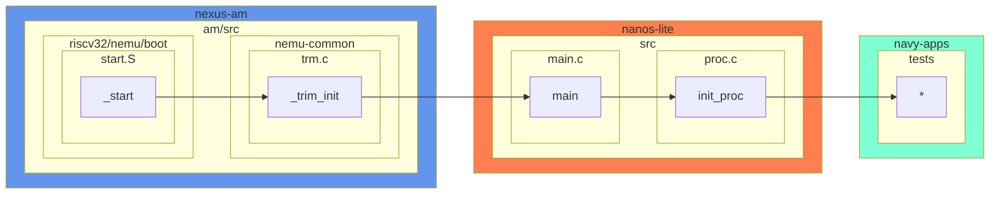


**系统调用过程**在`ramdisk.img`中的程序使用系统调用时，一般是`navy-apps/libs/libc`中的库函数，这些函数会经过层层绕绕后调用`navy-apps/libs/libos/src/nanos.c`中的一些函数，这些函数都会调用`intptr_t _syscall_(intptr_t type, intptr_t a0, intptr_t a1, intptr_t a2)`，这个函数会对寄存器进行赋值并执行`ecall`。然后会进入`nexus-am/am/src/riscv32/nemu/trap.S`的`__am_asm_trap`函数，这个函数会将所有寄存器压栈，并将栈顶作为参数调用`nexus-am/am/src/riscv32/nemu/cte.c`中的`__am_irq_handle`，这个函数会调用在**NANOS**中定义的`user_handler`也就是`nanos-lite/src/irq.c`中的`static _Context* do_event(_Event e, _Context* c)`函数，这个函数又会调用`nanos-lite/src/syscall.c`中的`_Context* do_syscall(_Context* c)`函数来在操作系统层面处理。

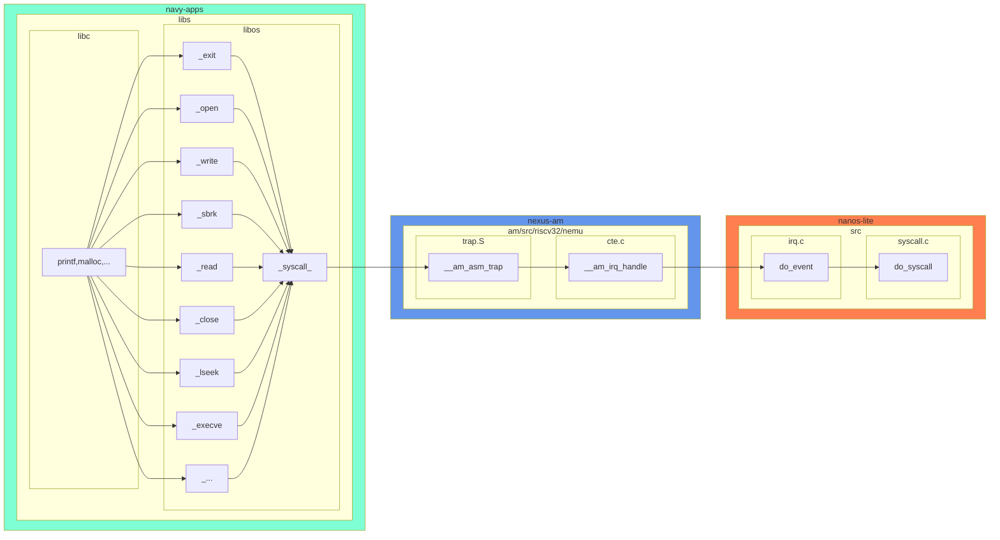


这一阶段，需要实现`nanos-lite/src/irq.c`中的事件分发,以及`nanos-lite/src/syscall.c`中的系统调用，为了使得`navy-apps/tests/hello`能正确输出。需要实现`SYS_exit`，`SYS_yield`，`SYS_write`，`SYS_brk`，`SYS_execve`。这里通过`libc`中源代码我们对`libc`中的`printf`做一个简单的分析，在进入操作系统层面前`printf`一共使用了13层调用:fearful: WTF!

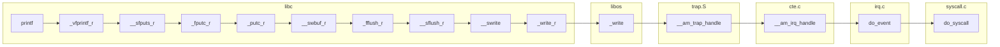

1. `SYS_exit`

​	直接调用`_halt()`就行

2. `SYS_yield`

   直接调用`_yield()`就行

3. `SYS_write`

   对于`fd`为1或者2，则直接输出到`stdout`就行，当`fd`为其它时调用`fd_write`写入到文件

4. `SYS_brk`

   这里没有太看懂Gitbook上的内容，我的理解是将`_heap.start`增加`GPR2`个大小，返回之前的`_heap.start`
   
   后来通过阅读`nexus-am/am/src/riscv32/nemu/boot/loader.ld`以及伟哥的帮助，终于弄懂了一些
   
   这里放上`loader.ld`的代码
   
   ```c
   SECTIONS {
     . = 0x80100000;
     .text : {
       *(entry)
       *(.text)
     }
     etext = .;
     _etext = .;
     .rodata : {
       *(.rodata*)
     }
     .data : {
       *(.data)
     }
     edata = .;
     _data = .;
     .bss : {
   	_bss_start = .;
       *(.bss*)
       *(.sbss*)
       *(.scommon)
     }
     _stack_top = ALIGN(4096);
     . = _stack_top + 0x8000;
     _stack_pointer = .;
     end = .;
     _end = .;
     _heap_start = ALIGN(4096);
     _heap_end = 0x88000000;
   }
   ```
   
   可以看到程序一共分为几大段`.text`，`.roddata`，`.data`，`.bss`，`.stack`，`.heap`，前面四段在编译完后大小就可以确定了，因此整个程序空间剩下的作为运行时变化的`.stack`和`.heap`段使用。整个程序运行空间大小为`0x880000000-0x80100000`，其中栈和堆从两边分别向对侧生长，界限由`_end`控制。为了确认我们的想法，可以观察一下`nexus-am/am/src/nemu-common/trm.c`中对`_heap`的定义
   
   ```c
   /*
   nexus-am/am/src/nemu-common/trm.c
   */
   #include <am.h>
   #include <nemu.h>
   
   extern char _heap_start;
   extern char _heap_end;
   int main(const char *args);
   
   _Area _heap = {
     .start = &_heap_start,
     .end = &_heap_end,
   };
   ```
   
   可以发现堆的定义就是从`loader.ld`中读取`_heap_start`和`_heap_end`。因此在`nanos.c`中进行修改
   
   ```c
   /*
   navy-apps/libs/libos/src/nanos.c
   */
   extern char end;
   void *_sbrk(intptr_t increment) {
     static void* program_break = (uintptr_t)&end;
     void* old = program_break;
     if(_syscall_(SYS_brk,program_break+increment,0,0)==0){
       program_break += increment;
       return old;
     }
     return (void*)-1;
   }
   ```
   
   `syscall.c`中相应的实现为
   
   ```c
   case SYS_brk:{
         printf("sys brk\n");
         if(c->GPR2<=_heap.start||c->GPR2>=_heap.end){
           c->GPRx = -1;
         }
         break;
       }
   ```
   
5. `SYS_execve`

   这个是直接调用`naive_loader`就好了，但是在实现`naive_loader`（调用了`loader`）的时候需要对elf文件格式很了解（这个文件格式有很多不合理的地方，历史遗留问题，老屎山了:poop:），可以看看[B站上对这个文件格式的讲解](https://b23.tv/afki9uB)，我这里就直接提供源代码

   ```c
   static uintptr_t loader(PCB *pcb, const char *filename) {
     if(filename == NULL){
       Elf_Ehdr ehdr;
       ramdisk_read(&ehdr,0,sizeof(Elf_Ehdr));
       Elf_Phdr phdr[ehdr.e_phnum];
       ramdisk_read(phdr,ehdr.e_ehsize,sizeof(Elf_Phdr)*ehdr.e_phnum);
       for(size_t i=0;i<ehdr.e_phnum;++i){
         if(phdr[i].p_type==PT_LOAD){
           ramdisk_read((void*)phdr[i].p_vaddr,phdr[i].p_offset,phdr[i].p_memsz);
           memset((void*)(phdr[i].p_vaddr+phdr[i].p_filesz),0,phdr[i].p_memsz-phdr[i].p_filesz);
         }
       }
       return ehdr.e_entry;
     }else{
       int fd = fs_open(filename, 0,0);
       Elf_Ehdr ehdr;
       int ret = fs_read(fd, &ehdr,sizeof(Elf_Ehdr));
       assert(ret!=-1);
       ret = fs_lseek(fd,ehdr.e_ehsize,SEEK_SET);
       assert(ret!=-1);
       Elf_Phdr phdr[ehdr.e_phnum];
       ret = fs_read(fd,phdr,sizeof(Elf_Phdr)*ehdr.e_phnum);
       assert(ret!=-1);
       for(size_t i=0;i<ehdr.e_phnum;++i){
         if(phdr[i].p_type==PT_LOAD){
           ret = fs_lseek(fd,phdr[i].p_offset,SEEK_SET);
           assert(ret!=-1);
           ret = fs_read(fd,(void*)phdr[i].p_vaddr,phdr[i].p_memsz);
           assert(ret!=-1);
           memset((void*)(phdr[i].p_vaddr+phdr[i].p_filesz),0,phdr[i].p_memsz-phdr[i].p_filesz);
         }
       }
       fs_close(fd);
       return ehdr.e_entry;
     }
   
   }
   ```

   

值得注意的是`nexus-am/am/include/arc/riscv32-nemu.h`中对`struct _Context`的定义与`nexus-am/am/src/riscv32/nemu/trap.S`中的压栈顺序并不一致，所以我对`struct _Context`的定义做了修改


### 3.2.文件系统

这里主要实现的是`nanos-lite/src/fs.c` 

这里解释一下`nanos-lite/src/files.h`这个文件include在`nanos-lite/src/fs.c`的`file_table`中，所以文件系统的所有文件包含了`file_table`中的以及`files.h`中的。由于我们的一切皆文件，所以还需要在`file_table`中加上`/dev/events`，`/proc/dispinfo`，`/dev/fb`，`dev/fbsync`，`/dev/tty`。这些虚拟文件分别在`fs_read`，`fs_write`中做特殊处理。为了处理这些特殊文件，我们会用到`nanos-lite/src/device.c`中的函数，这些函数只需要调用`nexus-am/am/am.h`中的`_io_read`就可以完成设备的读写操作，顺带提一句，这里的`fb_write`真的是蛋疼，在`_io_read`接口把线性空间写操作改为长方形写操作，在`nexus-am/am/src/nemu-common/nemu-video.c`的`__am_video_write`函数中又还原成线性写操作，这不是闲的蛋疼么，是不是闲我们CPU占用太低了拉点CPU占用:sweat_smile:。

`Finfo`结构体中需要增加成员记录文件打开后的偏移位置。值得注意的是，:star:千万不要把文件指针直接返回，结构体在出函数时会自动销毁，建议返回文件在`file_table`中的索引位置。

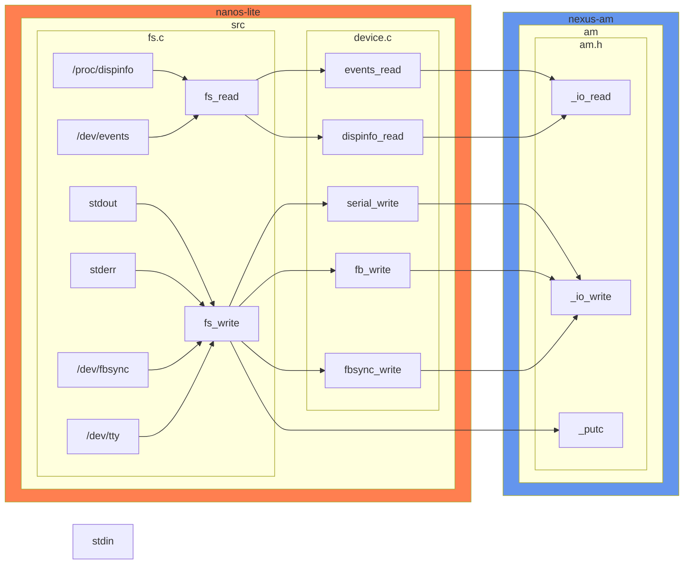


**特殊文件读写权限**

* Read Only

  `/proc/dispinfo`，`/dev/events`

* Write Only

  `stdout`，`stderr`，`/dev/fb`，`/dev/fbsync`，`/dev/tty`

* Forbidden

  `stdin`

**`/nanos-lite/src/fs.c`**

1. `Finfo`

   ```c
   typedef struct {
     char *name;
     size_t size;
     size_t disk_offset;
     size_t open_offset;
     ReadFn read;
     WriteFn write;
   } Finfo;
   ```

2. `file_table`

   ```c
   static Finfo file_table[] __attribute__((used)) = {
     {"stdin", 0, 0, 0,invalid_read, invalid_write},
     {"stdout", 0, 0, 0,invalid_read, invalid_write},
     {"stderr", 0, 0, 0,invalid_read, invalid_write},
     {"/dev/events",0,0,0},
     {"/proc/dispinfo",0,0,0},
     {"/dev/fb",0,0,0},
     {"/dev/fbsync",0,0,0},
     {"/dev/tty",0,0,0},
   #include "files.h"
   };
   ```

2. `int fs_open(const char* pathname, int flags, int mode)`
   设置结构体中的`open_offset`为0就好，返回的`fd`最好不是结构体指针，c语言会蛋疼的销毁结构体，最好返回位置索引。

3. `size_t fs_read(int fd, void *buf, size_t len)`

   对于可读特殊文件调用相应的系统函数就好（`events_read`，`dispinfo_read`）

4. `size_t fs_write(int fd, void *buf, size_t len)`

   对于可写特殊文件调用相应的系统函数就好（`_putc`，`fb_write`，`fbsync_write`，`serial_write`）

**`/nanos-lite/src/device.c`**

1. `size_t serial_write(const void *buf, size_t offset, size_t len)`

   调用`_putc`输出到`stdout`。

2. `size_t events_read(void *buf, size_t offset, size_t len)`

   调用`_io_read`读取按键并和掩码`0x7fff`做与运算按照格式输出到`buf`。

3. `size_t dispinfo_read(void *buf, size_t offset, size_t len)`

   在`void init_device()`中一开始就初始化`dispinfo`字符串，这个时候只需要复制到`buf`里即可。

4. `size_t fb_write(void *buf, size_t offset, size_t len)`

   这里我实现了将线性赋值变成了一到三个矩形画图，这个转换真的是闲的蛋疼:sweat:，我直接放代码好了。

   ```c
   size_t fb_write(void *buf, size_t offset, size_t len) {
   #ifdef MULTIPROC
     _yield();
   #endif
     offset /=4;
     //printf("fb write buf:0x%x offset:%d len:%d\n",buf,offset,len);
     uint32_t * p=buf;
     len = min(H*W-offset,len);
     int ret = len;
     _DEV_VIDEO_FBCTL_t ctl ;
     ctl.pixels = p;
     ctl.x = offset%W;
     ctl.y =offset/W;
     ctl.w = W-offset%W;
     ctl.h = 1,
     ctl.sync = 0,
     _io_write(_DEV_VIDEO, _DEVREG_VIDEO_FBCTL, &ctl, sizeof(ctl));
     
     ctl.x=0;
     ctl.y+=ctl.h;
     len-=ctl.w*ctl.h;
     p+=ctl.w*ctl.h;
     if(len/W){
       ctl.h=len/W;
       ctl.w =W;
       ctl.pixels=p;
       _io_write(_DEV_VIDEO, _DEVREG_VIDEO_FBCTL, &ctl, sizeof(ctl));
       ctl.y+=ctl.h;
       len-=ctl.h*ctl.w;
       p+=ctl.h*ctl.w;
     }
   
     if(len){
       ctl.pixels = p;
       ctl.w = len;
       ctl.h = 1;
       _io_write(_DEV_VIDEO, _DEVREG_VIDEO_FBCTL, &ctl, sizeof(ctl));
     }
     return ret;
   }
   ```

5. `size_t fbsync_write(const void *buf, size_t offset, size_t len)`

   这里没啥技术含量，仿照之前的test里面的代码写一写就好了

   ```c
   size_t fbsync_write(const void *buf, size_t offset, size_t len) {
    _DEV_VIDEO_FBCTL_t ctl;
    ctl.pixels = NULL;
    ctl.x = ctl.y = ctl.w = ctl.h = 0;
    ctl.sync = 1;
    _io_write(_DEV_VIDEO, _DEVREG_VIDEO_FBCTL, &ctl, sizeof(ctl));
    return 0;
   }
   ```

   

   


值得注意的是，我在WSL中发现`files.h`的`/share/texts/num`文件大小是6000字节，而不是5000字节，猜测与windows系统地`\n\r`有关，所以在做`/bin/text`测试时，需要在`navy-apps/tests/text/text.c`修改测试代码


### 3.3测试

在`nanos-lite/src/proc.c`的`void init_proc()`中，修改`naive_load`的文件就可以了，这些文件可以是`files.h`中的任何可执行文件。如果需要运行PAL(仙剑奇侠传，那么需要下载额外文件到`navy-apps/apps/pal`)

### 3.4.注意事项

1. `nexus-am/am/include/arc/riscv32-nemu.h`中对`struct _Context`的定义与`nexus-am/am/src/riscv32/nemu/trap.S`中的压栈顺序并不一致，所以我对`struct _Context`的定义做了修改
2. 千万不要把文件指针直接返回，结构体在出函数时会自动销毁，建议返回文件在`file_table`中的索引位置。
3. 我在WSL中发现`files.h`的`/share/texts/num`文件大小是6000字节，而不是5000字节，猜测与windows系统地`\n\r`有关，所以在做`/bin/text`测试时，需要在`navy-apps/tests/text/text.c`修改测试代码
3. 在debug时，可以修改`navy-apps/tests/*`下的文件来进行错误定位，在编译后，可以使用`riscv64-unkown-elf-objdump`指令来反汇编`navy-apps/fsimg/bin`下的二进制文件进行观察

****

## 4.PA4 NANOS-LITE pro

#### 4.1.多进程

程序加载流程为

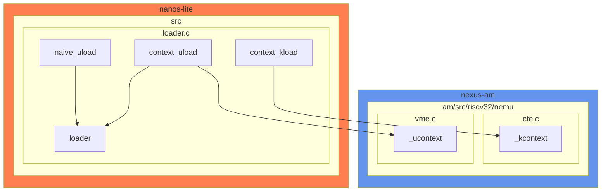

进程切换的流程为

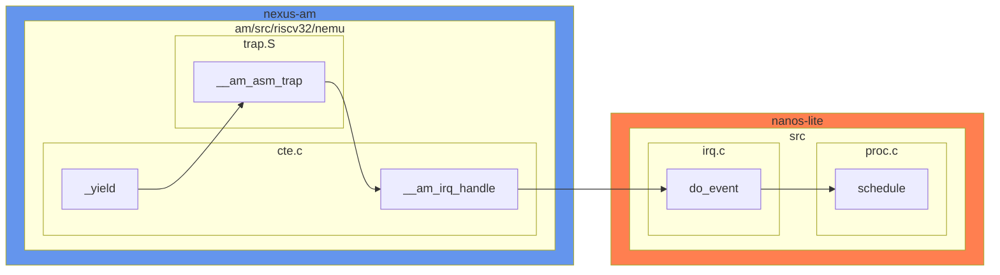

所有涉及到的文件就一目了然了

1. **`nexus-am/am/src/riscv32/nemu/trap.S`**

   首先`__am_irq_handle`需要重置`sp`，因为在`__am_irq_hanlde`期间，如果是切换进程，那么`Context`都会改变，所以需要将新的`Context`导出到寄存器	

   ```
      mv a0, sp
      jal __am_irq_handle
      mv sp, a0
   ```

2. **`nanos-lite/src/irq.c`**

   `_Context* do_event(_Event e, _Context* c)`当操作系统收到`EVENT_YIELD`时，需要调用`schedule`来切换进程

   ```c
       case _EVENT_YIELD:{
         printf("event yield\n");
         c=schedule(c);
         break;
       }
   ```

3. **`nanos-lite/src/loader.c`**

   在`context_uload`中，首先使用`loader`将代码段装到`pcb`，不同进程的代码是不同的，然后调用`_ucontext`对上下文进行初始化


### 4.2.分页

分页机制就是使用虚拟地址而不是实际地址来，然而并不是所有的虚拟地址都会映射到物理地址。当我们需要使用哪些虚拟地址时便会建立映射。在`rtl_lm`或者`rtl_sm`访问地址的时候会根据一定策略来将虚拟地址转换为物理地址。

建立映射的位置有两个，一个是在程序加载的时候，还有一个是在程序运行时申请空间的时候。

####  4.2.1 程序加载

对于程序加载主要流程如下，`nanos-lite/src/loader.c`中按照页大小对程序进行读取 ，每读取一页通过调用`_map`建立虚拟地址到物理地址的映射存入`c->ptr`中（这个也是页目录）。注意编译时需要将`navy-apps/Makefile.compile`中`VME=enable`前的注释符号去掉，让Makefile将程序映射到`0x40000000`开头的虚拟地址空间。

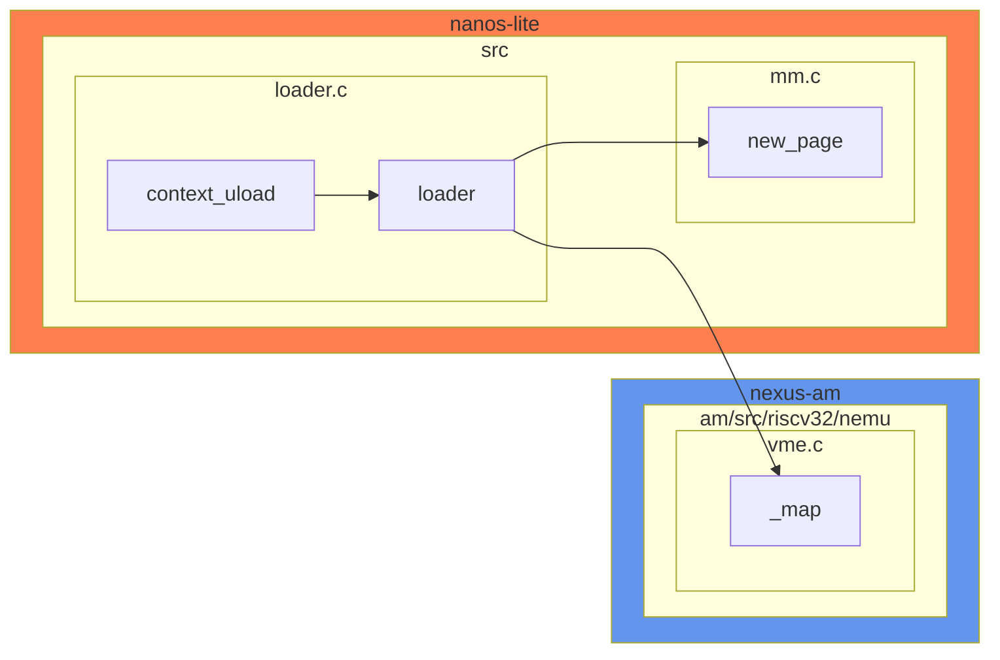

1. **`static uintptr_t loader(PCB *pcb, const char *filename) `**

   在加载程序的时候根据elf将每个块分页，读入分配物理地址，并调用`_map`来进行映射

2. **`int _map(_AddressSpace *as, void *va, void *pa, int prot)`**

    根据页目录基地址`as->ptr`，建立`va`到`pa`的映射，这里我规定`va`和`pa`都是页起始地址，也就意味着他们的低12位为0

#### 4.2.2.程序运行

在程序运行时，像`malloc`之类的函数会动态的申请新的虚拟地址，因此我们还需要对这部分动态申请的虚拟地址建立映射。申请空间会调用`SYS_brk`因此在调用`SYS_brk`的时候我们分配物理地址并进行映射就好了

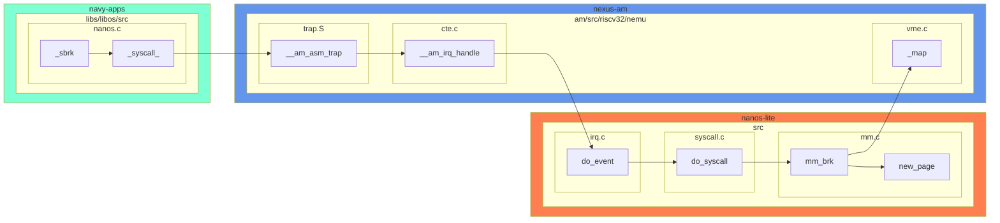

1. **`mm_brk(uintptr_t brk, intptr_t increment)`**

   为`[brk,brk+increment]`的虚拟空间分配物理空间并建立映射，如果有的虚拟页已经建立映射则直接跳过。

#### 4.2.3.运行时访存

除了建立映射， 在访问时还需要根据映射来进行虚地址到物理地址的转换。因此还需要在地址访问时进行转化。转换的依据是`satp`寄存器，最高位为模式为，`1`时为开启分页，`0`为关闭分页。`PPN`为页目录基地址右移12位，可以将`satp<<12`得到`pdir`页目录基地址。


在执行`isa_vaddr_read`/`isa_vaddr_write`时，需要判断是否开启分页 ，如果开启分页则调用`page_translate`来映射地址再进行读取，需要注意跨页情况。

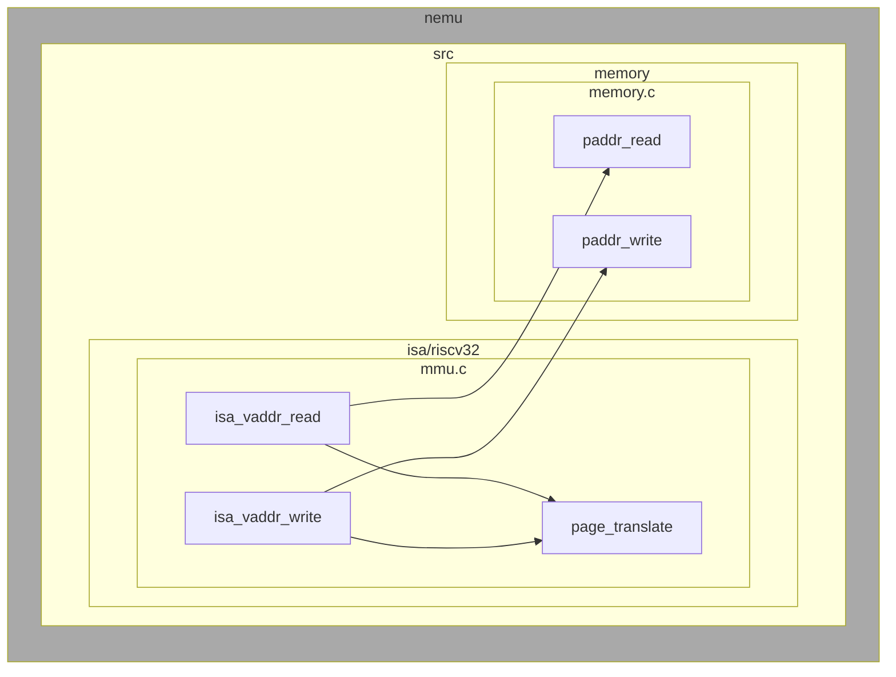

1. **`paddr_t page_translate(vaddr_t vaddr)`**

  `page_translate`函数可以根据下图来实现

   

  为了展示更详细一点，这里提供一个简单的实现代码

   ```c
    uint32_t page_translate(uint32_t* pdir,uint32_t vaddr){
        /*
            simple version of page_translate
            @pdir :page directory
            @vaddr:virtual address
        */
        uint32_t pdx = (vaddr>>22)&0x3ff;
        uint32_t ptx = (vaddr>>12)&0x3ff;
        uint32_t off = vaddr&0xfff;
        uint32_t pde = pdir[pdx];
        assert(pde&0x1);//assert the pde is valid
        uint32_t* ptab = (pde&~0x3ff)<<2;
        uint32_t pte = ptab[ptx];
        assert(pte&0x1);//assert the pte is valid
        uint32_t paddr = ((pte&~0x3ff)<<2)|off;
        return  paddr;
    }
   ```

2. **`uint32_t isa_vaddr_read(vaddr_t addr, int len)`**

   如果`satp.MODE`为1，则为开启分页，此时要判断是否跨页，如果跨页则分别读取并凭借，否则直接通过`page_tranlsate`转换为物理地址进行读取。如果`stap.MODE`为0，则直接当做物理地址进行读取。

3. **`void isa_vaddr_write(vaddr_t addr, uint32_t data, int len)`**

   同理

#### 4.2.4.进程切换

对于不同进程切换的情况，页目录基地址也会随之改变，因此需要跟随进程切换一同切换`satp`,在陷入后，立即将当前页目录基地址放入上下文进行保存。在操作执行完之后，立即更新当前的`satp`，因为进程切换了，所以`satp`要跟着切换

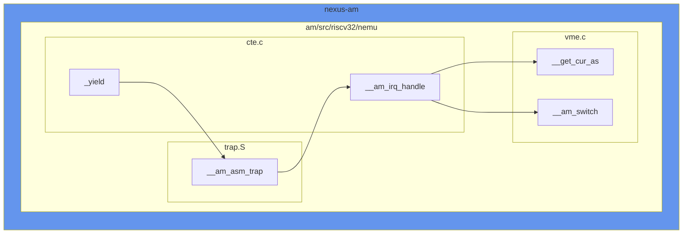

1. **`_Context* __am_irq_handle(_Context *c)`**

   在开头调用`__get_cur_as`将当前的页目录基地址存储入当前的上下文。在结束时调用`__am_switch`将新的页目录基地址更新到`satp`中。

### 4.3.中断

终端主要分为三个流程。其一是时钟，时钟每次被唤起都会将`cpu.INTR`置1。其二，`cpu`每次执行一次`exec_once`便会调用`isa_query_intr`判断是否需要中断，如果是则调用`raise_intr`进行自陷，来进行中断处理。因为我们不想在处理中断时被中断，因此在进入自陷前关掉中断并保存中断状态`sstatus.PIE`到`sstatus.SIE`，在出`sret`最后一步再进行恢复。其三，在进入自陷处理函数`__am_irq_handle`时需要判断自陷诱发原因是否是时钟中断，如果是则需要传递信息给事件处理函数`do_event`


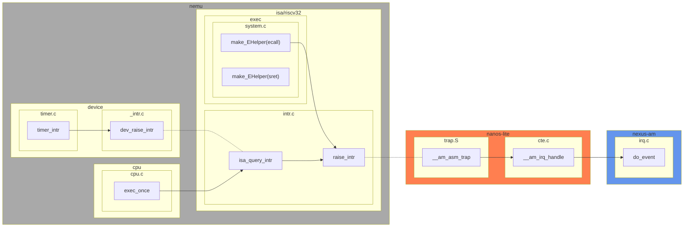

由于时间原因，这个阶段虽然代码已经实现，但是还是有bug。

****
## 5.PA5 PAL pro

### 5.1.浮点数

实现`navy-app/apps/pal/include/FLOAT.h`和`navy-apps/apps/src/FLOAT/FLOAT.c`就可以了

```c
//navy-app/apps/pal/include/FLOAT.h
static inline int F2int(FLOAT a) {return (a &= 0xffff0000)>>16;}
static inline FLOAT int2F(int a) {return a << 16;}
static inline FLOAT F_mul_int(FLOAT a, int b) {return a * b;}
static inline FLOAT F_div_int(FLOAT a, int b) {return a / b;}
```

```c
//navy-apps/apps/src/FLOAT/FLOAT.c
FLOAT F_mul_F(FLOAT a, FLOAT b) {
	long long c = (long long)a * (long long)b;
	return (FLOAT)(c >> 16);
}

FLOAT F_div_F(FLOAT a, FLOAT b) {
	FLOAT p, q;
	asm volatile("idiv %2" : "=a"(p), "=d"(q) : "r"(b), "a"(a << 16), "d"(a >> 16));
	return p;
}

FLOAT f2F(float a) {
	int b = *(int *)&a;
	int sign = b >> 31;
	int exp = (b >> 23) & 0xff;
	FLOAT c = b & 0x7fffff;
	if (exp != 0) {
		c += 1 << 23;
	}
	exp -= 150;
	if (exp < -16) {
		c >>= -16 - exp;
	}
	if (exp > -16) {
		c <<= exp + 16;
	}
	return sign == 0 ? c : -c;
}

FLOAT Fabs(FLOAT a) {
	FLOAT b;
	if (a > 0){
		b = a;
	} else {
		b = -a;
	}
	return b;
}
```

### 5.2.JIT

这让:older_man:怎么实现啊:sweat_smile:，看看得了，感觉龙芯说用LoongArch跑x86也是跟这个一样，做汇编级别的翻译。

****

