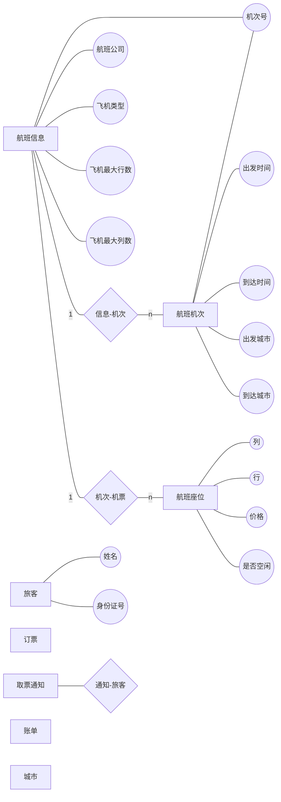
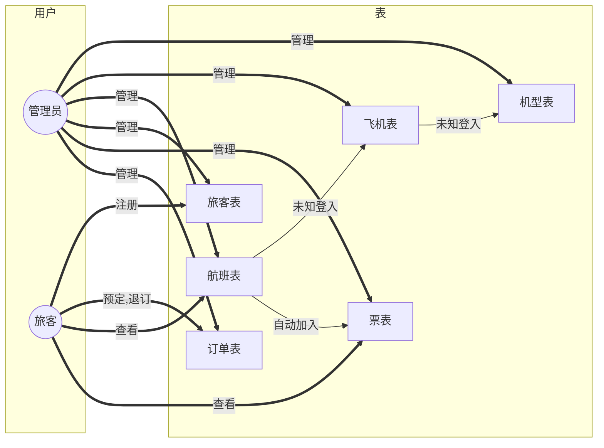

# Lab1

## 1

```sql
create database covid19mon;
```


## 2

```sql
drop database if exists covid19mon;
create database if not exists covid19mon;
use covid19mon;
```


### 表1 人员表(person)

| 字段名称  | 数据类型 | 备注                                   |
| --------- | -------- | -------------------------------------- |
| id        | int      | 人员编号,主码,主码约束名为pk_person    |
| fullname  | char(20) | 姓名，不可空                           |
| telephone | char(11) | 手机号码，不可空。自己无号，填近亲属的 |

```sql
create table person(id int not null,fullname char(20) not null,telephone char(11) not null,constraint pk_person primary key (id)
);
```

### 表2 地点表(location)

| 字段名称      | 数据类型 | 备注                                  |
| ------------- | -------- | ------------------------------------- |
| id            | int      | 地点编号,主码,主码约束名为pk_location |
| location_name | char(20) | 地点名称，不可空                      |

```sql
create table location(id int not null, location_name char(20) not null, constraint pk_location primary key (id));
```


### 表3 行程表（itinerary）

| 字段名称 | 备注                                          | 数据类型 |
| -------- | --------------------------------------------- | -------- |
| id       | 行程编号,主码,主码约束名为pk_itinerary        | int      |
| p_id     | 人员编号,外码,外码约束名为fk_itinerary_pid    | int      |
| loc_id   | 所在地点编号，外码,外码约束为fk_itinerary_lid | int      |
| s_time   | 到达该地点的时间                              | datetime |
| e_time   | 离开该地点的时间                              | datetime |

```sql
create table itinerary(id int not null, p_id int ,loc_id int, s_time datetime, e_time datetime, constraint pk_itinerary primary key (id), constraint fk_itinerary_pid foreign key(p_id) references person(id), constraint fk_itinerary_lid foreign key (loc_id) references location(id));
```


### 表4 诊断表（diagnose_record）

| 字段名称      | 数据类型s | 备注                                          |
| ------------- | --------- | --------------------------------------------- |
| id            | int       | 诊断编号,主码,主码约束为pk_diagnose_record    |
| p_id          | int       | 人员编号,外码,外码约束名为fk_diagnose_pid     |
| diagnose_date | datetime  | 诊断日期                                      |
| result        | int       | 诊断结果。1：新冠确诊;2：无症状感染者;3：正常 |

```sql
create table diagnose_record(id int not null, p_id int, diagnose_date datetime, result int, constraint pk_diagnose_record primary key (id), constraint fk_diagnose_pid foreign key (p_id) references person(id), check(result > 0 and result < 4));
```


### 表5 密切接触者表（close_contact）

| 字段名称     | 数据类型 | 备注                                             |
| ------------ | -------- | ------------------------------------------------ |
| id           | int      | 密切接触编号,主码,主码约束名为pk_close_contact   |
| p_id         | int      | 被接触人员编号,外码,外码约束名为fk_contact_pid   |
| contact_date | datetime | 接触日期                                         |
| loc_id       | int      | 接触地点编号，外码,外码约束名为fk_contact_lid    |
| case_p_id    | int      | 病例人员编号。外码,外码约束名为fk_contact_caseid |

```sql
create table close_contact(id int not null, p_id int, contact_date datetime, loc_id int, case_p_id int, constraint pk_close_contact primary key (id), constraint fk_contact_pid foreign key(p_id) references person(id), constraint fk_contact_lid foreign key(loc_id) references location(id), constraint fk_contact_caseid foreign key(case_p_id) references person(id));
```


### 表6 隔离表（isolation_record）

| 字段名称    | 数据类型 | 备注                                             |
| ----------- | -------- | ------------------------------------------------ |
| id          | int      | 隔离编号,主码，主码约束名为pk_isolation          |
| p_id        | int      | 被隔离人员编号,外码,外码约束名为fk_isolation_pid |
| s_date      | datetime | 开始隔离日期                                     |
| e_date      | datetime | 结束隔离日期                                     |
| isol_loc_id | int      | 隔离地点编号，外码,外码约束名为fk_isolation_lid  |
| state       | int      | 隔离状态：1：正在隔离 2：隔离结束 3：转入医院    |

注意：这里的隔离地点编号对应的是隔离地点表的地点编号，而不是地点表的地点编号。

```sql
create table isolation_record(id int not null, p_id int, s_date datetime, e_date datetime, isol_loc_id int, state int, constraint pk_isolation primary key(id), constraint fk_isolation_pid foreign key(p_id) references person(id), check(state>0 and state<4));
```


### 表7 隔离地点表（isolation_location）

| 字段名称      | 数据类型 | 备注                                           |
| ------------- | -------- | ---------------------------------------------- |
| id            | int      | 隔离地点编号,主码,主码约束名为pk_isolation_loc |
| location_name | char(20) | 隔离地点名                                     |
| capacity      | int      | 房间容量                                       |

```sql
create table isolation_location(id int not null, location_name char(20), capacity int, constraint pk_isolation_loc primary key(id));
```


```sql
alter table isolation_record add constraint fk_isolation_lid foreign key(isol_loc_id) references isolation_location(id);
```


# Lab2

## 1

任务描述
本关任务：练习insert语句,向人员表person插入数据。
这是上关建立的人员表，其结构如下：

表1 人员表(person)

| 字段名称  | 数据类型 | 备注                                   |
| --------- | -------- | -------------------------------------- |
| id        | int      | 人员编号,主码,主码约束名为pk_person    |
| fullname  | char(20) | 姓名，不可空                           |
| telephone | char(11) | 手机号码，不可空。自己无号，填近亲属的 |

编程要求
向人员表插入以下3条数据:

| id   | fullname | telephone   |
| ---- | -------- | ----------- |
| 1    | 张小敏   | 13907110001 |
| 2    | 李大锤   | 18907110002 |
| 3    | 孙二娘   | 13307100003 |

用一条insert语句，或用三条insert语句完成，都可以。请不要另外插入其它数据，确保表中仅有这三条语句，以免影响评测结果。

```sql
insert into person (id, fullname, telephone) values (1,"张小敏",13907110001),(2,"李大锤",18907110002),(3,"孙二娘",13307100003);
```


## 2

本关任务：删除前一关中插入的人员编号为2，姓名为’李大锤’的这条数据。

```sql
delete from person where fullname="李大锤";
```


## 3

将姓名为“张小敏”,人员编号为1的电话号码改为13607176668。

```sql
update person set telephone=13607176668 where fullname="张小敏";
```


# Lab3

## 0 for test

```sql
create table S(Sno int, Sname char(10), )
```


## 1

查询累计人流量大于30的地点名称和累计人流量，请用visitors作累积人流量的标题名称。查询结果按照人流量从高到低排序,人流量相同时，依地点名称的字典顺序排序。

```sql
select location_name, count(*) as visitors from itinerary,location where itinerary.loc_id=location.id  group by location_name having count(*) > 30 order by count(*) DESC, location_name ASC;
```


## 2

查询每个隔离地及该地正在进行隔离的人数，以number为隔离人数的标题.查询结果依隔离人数由多到少排序，隔离人数相同时，再依隔离点名称字典顺序排序。

```sql
select location_name, count(*) as number from isolation_location inner join isolation_record where isol_loc_id=isolation_location.id and state=1 group by location_name order by count(*) DESC, location_name ASC;
```


## 3

直接用一条SQL语句实现以下查询：
查询人员编号大于30的接续行程，输出信息包括：
人员编号,姓名,重合时间,起始地点id,起始地点,结束地点id,结束地点。
查询结果依人员编号排序。

```sql
select P.id as id, fullname, telephone, e_time as reclosing_time, loc_id_e as loc1, location_name_e as address1, loc_id_s as loc2, location_name_s as address2 from person as P, (select itinerary.p_id as p_id_e, location.id as loc_id_e, location_name as location_name_e, e_time from location,itinerary where location.id=itinerary.loc_id) as T1, (select itinerary.p_id as p_id_s, location.id as loc_id_s, location_name as location_name_s, s_time from location,itinerary where location.id=itinerary.loc_id) as T2 where P.id=p_id_e and P.id=p_id_s and P.id>30 and e_time=s_time order by P.id, e_time;
```


## 4

直接用一条语句写出能实现任务要求的SQL语句： 查询充珉瑶和贾涵山的行程情况。查询结果包括：姓名、电话、到过什么地方（地名），何时到达，何时离开 。 列名原样列出即可，不必用别名。查询结果依人员编号降序排序。同一人员行程依行程开始时间面序排列。

没有任何出行记录的，在出行有关的栏目内均填写NULL即可。

```sql
select fullname, telephone, location_name, s_time, e_time from (select id, fullname, telephone from person where fullname in ("充珉瑶","贾涵山")) as P left join (select p_id, location_name, s_time, e_time from location as L, itinerary as I where I.loc_id=L.id) as I on id=p_id order by id DESC, s_time ASC;

```


## 5

 查询地名中带有‘店’字的地点编号和名称。查询结果按地点编号排序。

```sql
select id, location_name from location where location_name like "%店%" sort by id;
```


## 6

新发现一位确诊者，已知他在2021.2.2日20:05:40到21:25:40之间在“活动中心”逗留，凡在此间在同一地点逗留过的，视为接触者，请查询接触者的姓名和电话。查询结果按姓名排序。

```sql
select fullname,telephone from person as P, location as L, itinerary as I where I.p_id=P.id and loc_id=L.id and !(s_time>"2021-02-02 21:25:40" or e_time<"2021-02-02 20:05:40" ) and location_name="活动中心" order by fullname;
```


## 7

查询仍在使用的隔离点名称。注意，隔离记录里如果只有隔离结束或确诊转院的记录，表明该隔离点已暂时停用，只要还有一个人在此处隔离，表明该隔离点仍在使用。查询结果按隔离点编号排序。

```sql
select location_name from isolation_location as IL, (select isol_loc_id, state, if(state=1,1,NULL) as used from isolation_record) as IR where IL.id=isol_loc_id group by location_name,IL.id,isol_loc_id having count(used)>0 order by IL.id;
```


## 8

用一条带exists关键字的SQL语句完成查询任务： 查询前30位有出行记录的人员姓名和电话。查询结果按照人员编号排序。

```sql
select fullname, telephone from person as P where exists(select * from itinerary as I where I.p_id=P.id) order by P.id limit 30;
```


## 9

写一条带NOT EXISTS 子查询的SQL语句实现下述查询要求： 查询人员表中没有去过地点“Today便利店”的人数。请给统计出的人数命名为number。

两层嵌套子查询，你只需要用一次not exists就可以了，另一个不作要求(怎么简单怎么写)。

````sql
select count(fullname) as number from person as P where not exists(select * from itinerary as I, location as L where I.p_id=P.id and I.loc_id=L.id and location_name="Today便利店") ;
````


## 10

直接用一条语句写出能实现任务要求的SQL语句： 查询人员表去过所有地点的人员姓名。查询结果依人员姓名的字典顺序排序。

你至少需要用一个not exists子查询才能完成该查询。至于第二层嵌套子查询，你应该有多种选择，你可以选择更简单的写法。我们不限定你怎么实现，只要求用一条语句。

```sql
select fullname from person where not exists (select * from location where not exists(select * from itinerary where p_id=person.id and loc_id=location.id)) order by fullname;
```


## 11

写一条SQL语句创建能反映所有隔离点现状的视图：isolation_location_status的创建，列名包括：

视图名称：isolation_location_status，内容包括： 隔离地点编号，隔离地点名，房间容量，已占用量。 请保持原列名不变，已占用量由统计函数计算得出，该计算列命名为occupied。只有正在该隔离点隔离的人才占用隔离点的位置。隔离结束或已转院的人表明已经腾出了原有位置，不再占用资源。

有的隔离点（如人员已腾空的隔离点，或新增的隔离点）没有隔离人员，占用量应当填0。

```sql
create view isolation_location_status as select IL.id as id, location_name, capacity, count(isol_loc_id) as occupied from isolation_location as IL left join (select isol_loc_id from isolation_record where state=1) as IR on isol_loc_id=IL.id group by location_name, IL.id, capacity;
```


## 12

写一条SQL语句实现任务要求： 从视图isolation_location_status中查询各隔离点的剩余空房间的数目。需要列出的数据项为：隔离点名称，剩余房间数。其中剩余房间数为计算得出，请给该列命名为available_rooms。查询结果依隔离点编号排序。

```sql
select location_name, capacity-occupied as available_rooms from isolation_location_status order by id;
```


## 13

直接用一条语句写出能实现任务要求的SQL语句： 查询靳宛儿接触者的姓名和电话。与靳宛儿在同一地点逗留时间有交集的均为其接触者。查询结果按照人员姓名排序。

```sql
select fullname, telephone from  person as P, itinerary as I, (select loc_id, s_time, e_time from person, itinerary where person.id=itinerary.p_id and person.fullname="靳宛儿") as S where I.p_id=P.id and S.loc_id=I.loc_id and !(I.s_time>S.e_time or I.e_time<S.s_time ) and fullname!="靳宛儿" order by fullname;
```


## 14

用一条SQL语句实现本询要求： 依据密切接触表的内容查询每个地点的密切接触者的数量，列出内容包括：地点名称，密接者人数。人数由统计获得，列名命名为close_contact_number.查询结果依密接者人数降序排列。密接者人数相同时，依地点名称排序。请用一条SQL语句实现该查询：

```sql
select location_name, count(I1.p_id) as close_contact_number from location L, itinerary I1, itinerary as I2 where I1.loc_id=L.id and I1.loc_id=I2.loc_id and !(I1.s_time>I2.e_time or I1.e_time<I2.s_time) group by location_name order by close_contact_number DESC, location_name ASC;


select location_name, count(*) as close_contact_number from location as L, close_contact as CC where CC.loc_id=L.id group by location_name order by close_contact_number DESC, location_name ASC;
```


## 15

用一条SQL语句实现查询任务： 查询感染人数最多的人员编号，姓名，和被其感染的人数。感染人数由统计所得，命名为infected_number. 请用一条SQL语句实现该查询。

```sql
select case_p_id as id,fullname,count(*) as infected_number from person as P, close_contact as CC where case_p_id=P.id group by case_p_id order by infected_number DESC  limit 1;
```


## 16

用一条SQL语句实现查询任务： 查询2021-02-02 10:00:00到14:00:00期间，行程记录最频繁的三个人的姓名及行程记录条数。记录条数命名为record_number。如果出现记录数并列情况，再按姓名排序。请用一条SQL语句实现该查询。

````sql
select fullname, count(*) as record_number from person as P, itinerary as I where I.p_id=P.id and !(s_time>"2021-02-02 14:00:00" or e_time<"2021-02-02 10:00:00") group by fullname order by record_number DESC, fullname ASC limit 3;
````


## 17

用一条SQL语句实现查询任务： 从隔离点中，查询房间数(capacity)居第二多的隔离点名称及其房间数。 注意：如果房间数从多到少依次有100,100,80,80,70,…，那么，两个80都是第2多。而两个100都是第1多。第1高和第2高查询其实都很简单。 更一般的查询是n高查询，这类问题经常出现在BAT的面试题中。同学们可以认真考虑一下哦。

```sql
select location_name, capacity from isolation_location where capacity=(select capacity from isolation_location order by capacity DESC limit 2,1);

```


# Lab4

## 1

隔离点的人员一旦确诊“新冠”后，将被转入医院，请 编写一个触发器，用于实现以下完整性控制规则： 当隔离表（isolation_record）中的某位隔离人员在诊断表（diagnose_record）中的诊断结果（result）为1(新冠确诊)”时，自动将隔离表中的隔离状态（state)改成3（转入医院）。


为了完成本关任务，你需要掌握： 对你所使用的DBMS的流程控制语句非常熟悉，包括但不限于以下内容： 

(1)变量申明语句(如declare)； 

(2)赋值语句（直接赋值，或用select查询的结果赋值）；

(3)if语句； 

(4)while语句； 

(5)触发器生存期内的特殊表：

- old和new(for MySQL, Oracle, DB2等)
- deleted和inserted(for SQL Server )

(6)create trigger语句的语法；

 (7)触发的时机：before ,after等； 

(8)触发事件：insert,delete,update。

请注意，以上每项内容，在不同的DBMS中都有区别，比如： (1) create trigger 语句的语法格式不同；

(2) SQL Server有instead of触发器，但MySQL没有；  MySQL有before触发器，但SQL Server没有。两者触发的时机虽然相同,都是在触发该触发器的那条语句(insert,delete,update)执行之前执行。但区别是：instead of触发器取代触发它的那条语句，而触发该触发器的那条语句本身并不执行。但before触发器执行完后，触发该触发器的语句本身会执行； 

(3) SQL Server一次可以定义多个事件(insert,delete,upate三者的任意组合)驱动的触发器，但MySQL一次只能定义一个事件(insert,delte,update三选一)驱动的触发器。这意味着，如果你希望多个事件均触发完整性检查，你得创建多个触发器。

(4) 触发器生存周期内的特殊表名不同。

(5) SQL Server不允许在触发器内修改inserted或updated表的内容。但MySQL的before触发器允许修改new表的内容。比如，当发现insert或update后的数据明显错误时，可以通过修改new表的内容纠正这一错误。但我们并不建议你这么做，一个更好的方法是：拒绝插入和修改，并提示错误原因。

(6) SQL Server的create trigger语句必须是批处理中的第一条语句，即它之前不允许有别的语句，否则这条create trigger语句将不会执行。请在create trigger语句前，写一条GO语句，使前面的语句全部执行完。这样，create trigger语句自然成为下一批语句的第一条。 (7) MySQL虽然允许你随时定义触发器，但要求你用“DELIMITER 界符”语句指定触发器定义语句的界符（即结束符)。我们推荐你使用“;;”(即两个连续的分号)作触发器定义语句的界符。请在触发器定义结束后重新指定语句的界符(恢复为单个分号)。

总之，我们建议你认真阅读你所使用的DBMS的官方手册，然后再动手编写触发器，它的主体是一段程序。所以，你务必掌握该语言的各类语句，以及create trigger语句本身。


用create trigger语句创建符合任务要求的触发器（触发器名称自已命名）： 当隔离表（isolation_record）中的某位隔离人员在诊断表（diagnose_record）中的诊断结果（result）为1(新冠确诊)”时，自动将隔离表中的隔离状态（state)改成3（转入医院）。

首先，请考虑清楚触发器应该建在哪个表上； 其次，请考虑触发器执行的时机； 接着，考虑什么事件(insert,update,delete)触发这个触发器运行； 最后，正确创建触发器。

提醒：当前你处于MySQL环境下。


评测程序将执行你的语句创建触发器，然后对相关表执行insert，update操作，来触发你定义的触发器，然后查看预期的结果有没有发生。如果执行insert或update语句后，发生的结果与预期结果一致即过关。

如果你第一次评测没有通过，请记得在下次评测前，drop掉先前创建的触发器。

```sql
drop trigger if exists fuckyou;
drop trigger if exists fuckyoudoubletime;
delimiter $
create trigger fuckyou 
before insert
on diagnose_record 
for each row 
begin 
update isolation_record set state=3 where isolation_record.p_id=NEW.p_id and NEW.result=1;
end$
delimiter ;
delimiter $
create trigger fuckyoudoubletime
before update
on diagnose_record 
for each row 
begin 
update isolation_record set state=3 where isolation_record.p_id=NEW.p_id and NEW.result=1;
end$
delimiter ;
```


# Lab5


本关任务： (1)编写一个依据人员编号计算其到达所有地点的次数(即行程表中的记录数)的自定义函数，同一人员到达同一地点多次，去几次算几次。 (2)并利用其查询至少有3条行程记录的人员。


为了完成本关任务，你需要掌握： (1)create function语句的语法； (2)使用自己创建的函数； (3)函数体可能用到的其它语句。


函数其实有多种，比如标量函数(仅返回一个值)和表函数(返回结果是表),语法也各不相同。这里，我们仅给出一个简化的创建标量函数的语法。这个简化的语法同时适用于SQL Server和MySQL。

create function语句的语法：

create function function_name([para data_type[,…]]) returns data_type begin    function_body;    return expression;  end

- function_name:函数名；
- para:参数名；
- data_type:参数的数据类型；
- 一个函数可以没有参数，也可以有多个。多参数间用逗号分隔。
- function_body:函数体。即由合法的SQL语句组成的程序段。
- expression:函数返回值，可以是常量、表达式，甚至是一条select语句查询的值（必须保证结果唯一);该值类型应与returns短语定义的类型相同。

函数一旦定义，就可以像内部函数一样使用，比如出现在select列表、表达式、以及where子句的条件中。


(1)用create function语句创建符合以下要求的函数：

- 依据人员编号计算其到达所有地点的次数(即行程表中的记录数)。
- 函数名为：Count_Records。函数的参数名可以自己命名

(2) 利用创建的函数，仅用一条SQL语句查询在行程表中至少有3条行程记录的人员信息，查询结果依人员编号排序。

友情提醒：当前你处于MySQL环境下。


评测程序将执行你的代码段创建函数，并执行查询，然后看执行结果与预期的结果是否一致。评测程序附加有别的语句，直接调用该函数。所以，即使你的SQL语句没有使用该函数也查询出了正确结果，仍不会通过评测。

如果你第一次评测没有通过，请记得在下次评测前，drop掉先前创建的函数。但请你确认你真的创建成功了这个函数，只是该函数运行的结果不符合预期，你需要修改后重新创建。如果这个函数根本没创建成功，你的drop语句会抛出异常，致使程序停止运行。我给你的建议是： (1) MySQL可以使用drop function IF EXISTS function_name; (2) SQL Server可以直接将create关键词改成alter，修改函数的定义（前提仍是该函数已创建，只是没有达到预期效果。如果没有创建成功，则保留关键词create不变，修订错误语句后，重新提交即可 ）。

```sql
delimiter $
create function Count_Records(pid int) returns int 
begin
declare x int;
select count(*) from itinerary where p_id=pid into x;
return x;
end$
delimiter ;

select * from person where Count_Records(id)>=3 order by id;
```


# 机票预订系统




```sql
drop database if exists airticket_booking;
create database airticket_booking;
use airticket_booking;
```


机型aircraft_type

| 飞机型号id | 行数col | 列数line |
| ---------- | ------- | -------- |
| char(20)   | int     | int      |
| pk         |         |          |

```sql
create table aircraft_type(id char(20) not null, col int not null, line int not null, name char(20),constraint pk_aircraft_type primary key(id));
```


飞机aircraft

| 飞机号id | 所属公司company | 飞机型号atid | 飞机名name |
| -------- | --------------- | ------------ | ---------- |
| int      | char(20)        | char(20)     | char(20)   |
| pk       |                 | aircraft(id) |            |

```sql
create table aircraft(id int not null auto_increment, company char(20) not null, atid char(20) not null, name char(20) not null, constraint pk_aircraft primary key(id), constraint fk_aircraft_atid foreign key(atid) references aircraft_type(id));
```


机场airport

| 机场号名id | 飞机场名airport_name | 城市名city_name | 省名province_name |
| ---------- | -------------------- | --------------- | ----------------- |
| int        | char(20)             | char(20)        | char(20)          |
| pk         |                      |                 |                   |

```sql
create table airport(id char(20) not null, city_name char(20) not null, province_name char(10), constraint pk_airport primary key(id));
```


航班flight

| 航班号id | 始发机场ID d_apid | 达到机场ID a_apid | 始发时间d_time | 到达时间a_time | 飞机号aid    |
| -------- | ----------------- | ----------------- | -------------- | -------------- | ------------ |
| int      | int               | int               | datetime       | datetime       | int          |
| pk       | airport(id)       | airport(id)       |                |                | aircraft(id) |

```sql
create table flight(id int not null auto_increment, d_apid char(20) not null, a_apid char(20) not null, d_time datetime not null, a_time datetime not null, aid int not null, constraint pk_flight primary key(id),constraint fk_flight_d_apid foreign key(d_apid) references airport(id), constraint fk_flight_a_apid foreign key(a_apid) references airport(id), constraint fk_flight_aid foreign key(aid) references aircraft(id));
```


```sql
create table flight(id int not null auto_increment,d_apid char(20) not null,a_apid char(20) not null,d_time datetime not null,a_time datetime not null,aid int not null,constraint pk_flight primary key(id),constraint fk_flight_d_apid foreign key(d_airport_id) references airport(id),constraint fk_flight_a_apid foreign key(a_airport_id) references airport(id),constraint fk_flight_aid foreign key(aid) references aircraft(id));
```


票ticket

座位号 A14  列号+行号


| 票号id | 航班号fid  | 列号col_ind | 行号line_ind | 状态state                                       | 价格price |
| ------ | ---------- | ----------- | ------------ | ----------------------------------------------- | --------- |
| int    | int        | int         | int          | int                                             | float     |
| pk     | flight(id) |             |              | 状态(0:空闲  1:预定  2：取票付款 3：未取票付款) |           |


```sql
create table ticket(id int not null auto_increment, fid int not null, sid char(5) not null, price float not null, constraint pk_ticket primary key(id), constraint fk_ticket_fid foreign key(fid) references flight(id),check(state>=0 and state<=3));
```


旅客passager

| 旅客身份证号id | 姓last_name | 名first_name | 邮箱email | 电话phone | 密码pwd  |
| -------------- | ----------- | ------------ | --------- | --------- | -------- |
| char(18)       | char(10)    | char(10)     | char(30)  | char(11)  | char(20) |
| pk             |             |              |           |           |          |

```sql
create table passager(
id char(18) not null,
last_name char(10) not null,
first_name char(10) not null,
phone char(11) not null,
email char(30) not null,
pwd   char(20) not null,
constraint pk_passager primary key(id));
)
```


订单booking

| 订单id | 旅客pid      | 票号tid    |
| ------ | ------------ | ---------- |
| int    | int          | int        |
| pk     | passager(id) | ticket(id) |

```sql
create table booking(id int not null auto_increment, pid int not null, tid int not null, constraint pk_booking primary key(id), constraint fk_booking_pid foreign key(pid) references  passager(id), constraint fk_booking_tid foreign key(tid) references ticket(id));
```


取票collect_ticket (view)

| 订单id | 旅客pid      | 票号tid                      | 取票时间ct_time |
| ------ | ------------ | ---------------------------- | --------------- |
| int    | int          | int                          | datetime        |
| pk     | passager(id) | ticket(id)所有预定状态可取票 |                 |

```sql
create view collect_ticket as select B.id as id, B.pid as pid, T.id as tid, date_sub(F.d_time, interval 1 day) as ct_time from booking as B, ticket as T, flight as F where B.tid=T.id and T.fid = F.id;
```

```sql
create view collect_ticket as select B.id as id, B.pid as pid, T.id as tid, date_sub(F.d_time, interval 1 day) as ct_time from booking as B, ticket as T, flight a s F where B.tid=T.id and T.fid=F.id;
```


账单bill (View)

| 订单号id | 价格price | 公司名company | 航班名fname | 票号tid | 座位号sid |
| -------- | --------- | ------------- | ----------- | ------- | --------- |
| int      | float     | char(20)      | char(20)    | int     | char(5)   |
| pk       |           |               |             |         |           |

```sql
create view bill as select B.id as bid, T.price as price, A.company as company, A.name as fname, T.id as tid, T.sid as sid from booking as B, flight as F, aircraft as A, ticket as T where B.tid=T.id and T.fid=F.id and F.aid=A.id;
```

```sql
create view bill as select B.id as bid, T.price as price, A.company as company, A.name as fname, T.id as tid, T.sid as sid from booking as B, flight as F, aircraft as A, ticket as T where B.tid=T.id and T.fid=F.id, F.aid=A.id;
```


插入基本数据

```sql
insert into aircraft_type(id, col, line, name) values (1, 6, 20, "波音727"),(2,8,30,"波音737"),(3,6,24,"波音747");
insert into aircraft(id, company, atid, name) values (1, "东方航空", 1, "A101"),(2,"东方航空",2,"A102"),(3,"南方航空",2,"Z11"),(4,"南方航空",3,"Z12");
insert into flight(id, d_apid, a_apid, d_time, a_time, aid) values(1,10,11,"2021-01-01 00:00:00","2021-01-01 08:00:00", 1);
```





