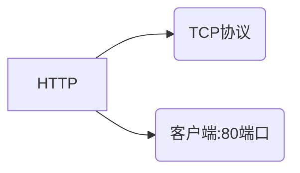
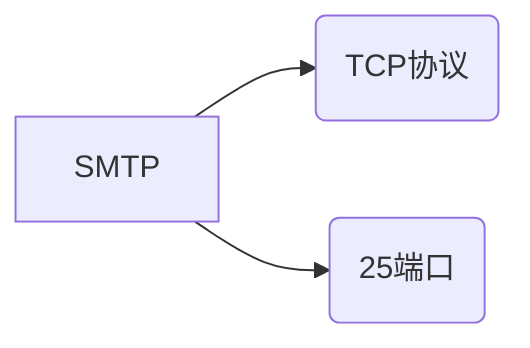
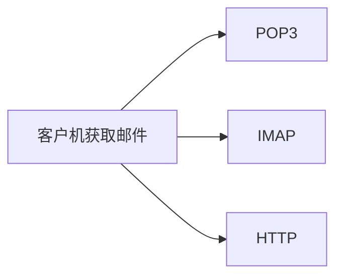
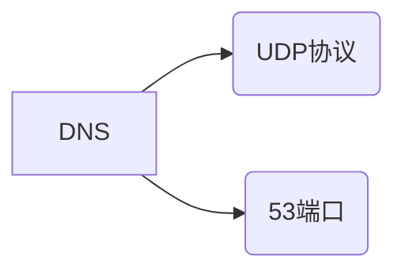
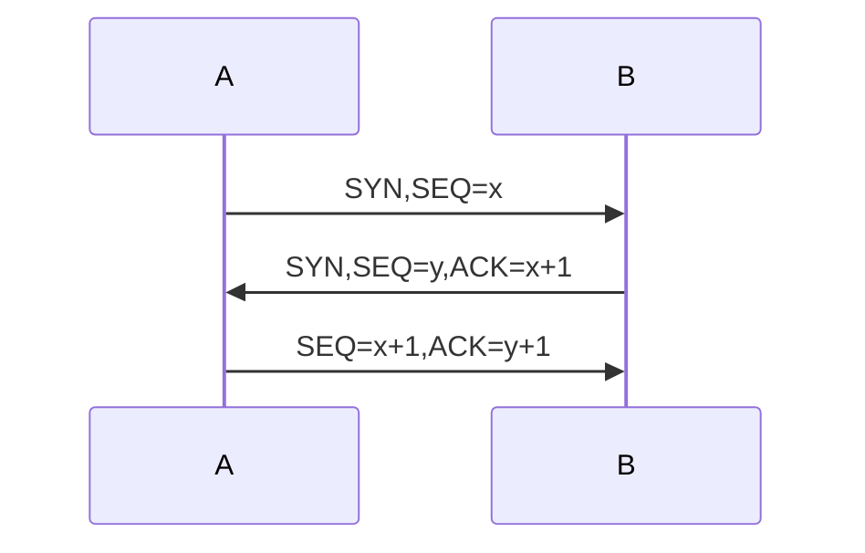
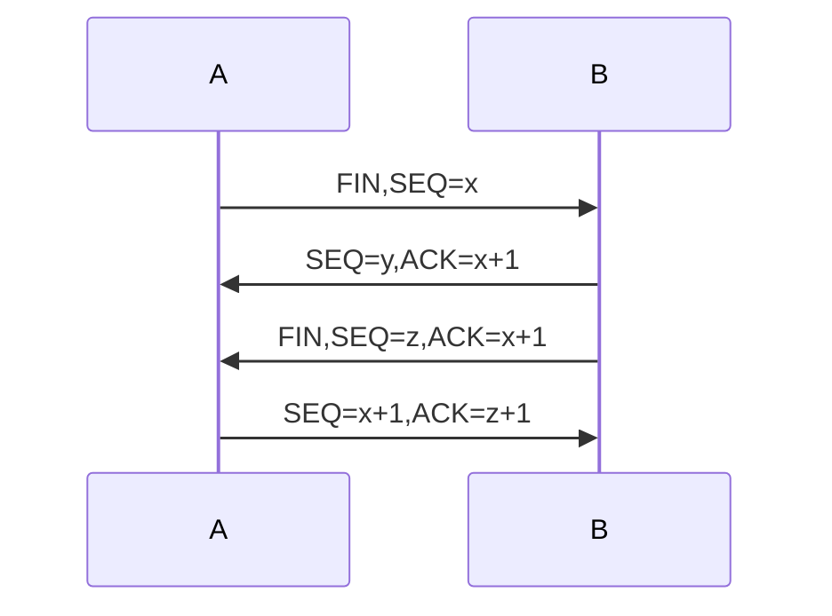
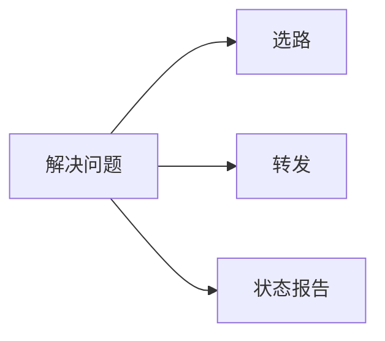
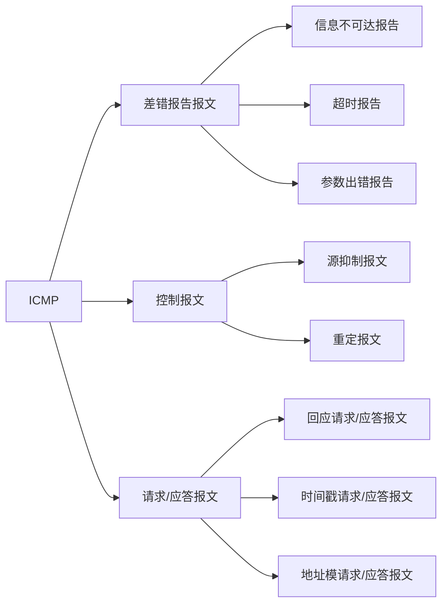
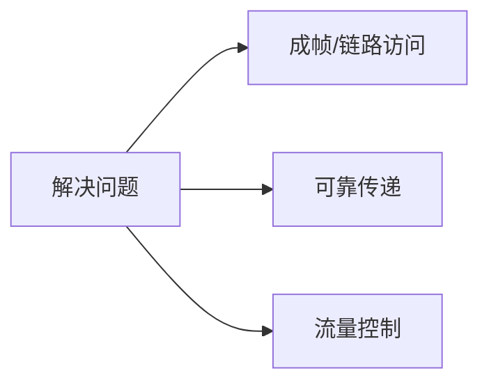

# 计算机网络

## 1.计算机网络与英特网

### 1.1网络结构

#### 1.1.1网络边缘

组成：端系统（主机）

$$接入网\begin{cases} 作用:将网络边缘与网络核心连接起来，通常是将端系统连接到边缘路由器（端系统到任何其他远程端系统的路径上的第一台路由器）上 \\接入方式\begin{cases}局域网(LAN)接入\\无线接入\begin{cases}无线局域网\\广域无线接入\end{cases}.\end{cases}\\ 物理媒体\begin{cases}导引型媒体\\非导引型媒体 \end{cases}\end{cases}$$

#### 1.1.2网络核心

$$数据交换过程\begin{cases}  建立连接\\交换数据\\释放连接   \end{cases}$$

$$计算机网络的演化\begin{cases} 电路交换\\报文交换\\分组交换\end{cases}$$

$$网络核心\begin{cases}  电路交换网络\begin{cases} FDM\\TDM  \end{cases}\\分组交换网络\begin{cases} 虚电路网络\\数据报网络\end{cases}  \end{cases}$$

$$电路交换网络的特点\begin{cases}   数据交换前需要建立一条端到端的物理通路，用户时钟占用端到端的固定传输信道\\交换双方不会存在任何延迟  \end{cases}$$

$$分组交换网络特点\begin{cases} 被传输的数据分成若干组分别传送\\数据传输前不必预先确定分组的传输路径\\网络核心中的每个交换节点均为共享节点，并且都具有分组的存储竹筏以及选择路由的能力\\在数据通信的过程中，网络核心动态分配传输带宽，使得通信线路的利用率提高\end{cases}$$

$$分组交换网络缺点\begin{cases}各节点存储转发总会造成一定的时延\\各分组携带的一定的控制信息，带来了额外的开销\\整个分组交换网络的管理和控制比较复杂\end{cases}$$

分组交换网络适用于突发性情况

### 1.2时延、丢包、吞吐量

$$时延\begin{cases}  处理时延t_{proc}：检查比特错误，确定输出链路\\排队时延t_{queue}：取决于路由器拥塞程度\\传输时延t_{trans}：\frac{L(分组长度)}{R(链路带宽)}\\传播时延t_{prop}：\frac{d(物理媒体长度)}{s(物理媒体中传播速度)}  \end{cases}$$

Traceroute:3个UDP分组

缓存队列满时，进行丢包

$$吞吐量(bps)\begin{cases}瞬时吞吐量\\平均吞吐量\end{cases}$$

吞吐量取串联链路上最小值

### 1.3协议

$$\begin{cases}  实体\\对等体\\协议\begin{cases}语法\\语义\\同步(时序)\end{cases}  \end{cases}$$

##          2.应用层

$$socket\begin{cases}32位主机地址\\16位端口地址\end{cases}$$

$$\begin{cases}WEB\\FTP\\SMTP\\DNS\\P2P \\\vdots\end{cases}$$

### 2.1WEB&HTTP

$$\begin{cases}HTML\quad\quad信息表的协议\\HTTP\quad\quad信息传输的协议\end{cases}$$

属于C/S模式

传输时间:2RTT+文件传输时间

$$\begin{cases}HTTP1.0\quad\quad非持久连接\\HTTP1.1\quad\quad持久连接\end{cases}$$

请求

响应

$$\begin{cases}  200\quad OK\\301\quad Moved Permanently\\400\quad Bad Request\\404\quad Not Found\\505\quad HTTP Version Not Supported   \end{cases}$$

cookie:内容和身份关联起来

流水线方式可以一次方法发送所有的请求，慢慢接收

### 2.2SMTP

报文全部使用7bitASCII码

### 2.3DNS

就近缓存在本地DNS

DNS查询分为递归查询和迭代查询两种

### 2.4P2P

## 3.运输层

进程和进程之间通信

发送方：将数据划分为保温段交给网络层

接收方：把报文段重组成应用数据，交付给应层

$$提供服务\begin{cases}  进程间数据交付\\差错检测  \\ 可靠数据传输 \\拥塞控制  \\（复用，分用） \end{cases} $$

### 3.1套接字

两元组（32位IP，16位端口）

逻辑通道：四元组（源IP，源端口，目的IP，目的端口）

### 3.2UDP

用户数据报协议（数据报）

无连接通信

$$提供功能\begin{cases}  多路复用/分解 \\差错检查  \end{cases}$$

长度：字节为单位

检验和回滚

### 3.3TCP

传输控制协议（报文段）

#### 3.3.1停等协议

##### 3.3.1.1 rdt1.0

##### 3.3.1.2 rdt2.0

$$改进\begin{cases}   差错检测\\反馈控制消息\\重传   \end{cases}$$

##### 3.3.1.3 rdt2.1

$$改进\begin{cases}   序列号   \end{cases}$$

##### 3.3.1.4 rdt2.2

$$改进:\begin{cases} 取消NAK\\在ACK中显式加入确认分组序号  \end{cases}$$

##### 3.3.1.5 rdt3.0实用停等协议

$$改进:\begin{cases}   倒数计时器\\信道不但出错而且丢包  \end{cases}$$

$$T_{transmit}=\frac{L(packet length in bits)}{R(transmission rate, bps)}$$

$$发送方利用率:U_{sender}=\frac{T_{transmimt}}{RTT+T_{transmit}}$$

$$传输速率 V=\frac{L}{2RTT}$$

能工作，但性能差

#### 3.3.2GBN

$$发送端窗口\leq2^k-1$$

$$接收端=1$$

#### 3.3.3SR

$$接收端窗口\leq2^{k-1}$$

#### 3.3.4TCP结构

首部长度：20-60B

序列号以字节为单位

#### 3.3.5TCP重传

$$RTT_{Estimated}=(1-\alpha)*RTT_{Estimated}+\alpha*RTT_{Sample}$$

$$\alpha = 0.125$$

$$第一次计算:RTT_{Estimated}=RTT_{Sample}$$

$$RTT_{Dev}=(1-\beta)*RTT_{dev}+\beta*|RTT_{Sample}-RTT_{Estimated}|$$

$$\beta = 0.25$$

$$第一次计算:RTT_{Dev}= 0.5*RTT_{Sample}$$

$$TimeoutInterval=RTT_{Estimated}+4*RTT_{Dev}$$

$$\begin{cases} TCP:Ack= Last Seq+1\\GBN/SR:Ack = Seq  \end{cases}$$

仅重传sendBase，即重传序号最小的未确认报文段，重启定时器

累计确认，每次接收都会返回ACK

快速重传:3个冗余ACK（接收到4个重复ACK）

每一次TCP重传均会将下一次超时间间隔设置为先前值的两倍

#### 3.3.6 TCP流量控制

可变滑动窗口

接收方每收到一个报文段就返回自己的剩余窗口大小

接收方满时，发送发发送1B的报文段进行试探

#### 3.3.7 TCP链接管理
三次握手
第三次握手会携带数据信息

四次挥手

#### 3.3.8 TCP拥塞控制

数据积压在网络核心

发送方实际窗口 = min(拥塞窗口，通知窗口)

拥塞程度:超时 > 三个冗余ACK

**Reno算法**加性增，乘性减(AIMD)

没RTT改变一次

初始阶段 指数增加

$$\begin{cases}慢启动\begin{cases} sstresh=16\\cwnd=1\\cwnd=指数增加，到达sstresh后线性增加  \end{cases}\\3个冗余ACK\begin{cases}cwnd=cwnd'/2+3\\sstresh=cwnd'/2\end{cases}\\超时\begin{cases} cwnd=1 \\ sstresh=cwnd'/2\end{cases}\end{cases}$$

$$吞吐量:\begin{cases} \frac{1.22<MSS}{RTT\sqrt L}  \end{cases}$$

## 4.网络层

主机与主机之间通信

$$为传输层提供服务\begin{cases}虚电路服务\\数据报服务\end{cases}$$

$$网络层主要功能\begin{cases} 为主机间通信进行选路\\将分组想适当链路进行转发\\对于面向连接的网络层服务,提供建立连接的功能 \end{cases}$$

### 4.1路由器
$$路由器:\begin{cases} \begin{cases} 网络层\\ 数据链路层 \\ 物理层 \end{cases}. \\ 结构\begin{cases} 输入端口\\ 交换结构\begin{cases}经内存交换：转发速度受限于内存带宽\\经总线交换\\经内联网络交换\end{cases}\\输出端口\end{cases}.  \\丢弃策略\begin{cases} 弃尾策略\\随机早期检测RED\begin{cases}avgth小于minth,允许进入分组\\argth大于maxth,分组被标记或者丢弃\\avgth在minth和maxth之间，按照概率标记或者丢弃\end{cases}\end{cases}\end{cases}$$

$$B(缓存区大小)=\frac{RTT(往返时延)\times R(交换机速率)}{\sqrt N(N条TCP链接)}$$

$$RED(随机早期检测)\begin{cases}  小于最小阈值\Rightarrow允许进入 \\ 大于最大阈值\Rightarrow标记或丢弃\\在最小阈值与最大阈值之间\Rightarrow概率丢弃   \end{cases}$$

### 4.2IP

$$版本\begin{cases}    IPv4\\IPv6     \end{cases}$$

$$IPv4缺点\begin{cases} 地址空间消耗很快\\首部长度度不确定,中间节点需要消耗相当资源用于分组处理\\缺少QoS\\安全性不够高\end{cases}$$

$$协议\begin{cases}  1.ICMP  \\  2.IGMP \\ 4.IP  \\6.TCP \\ 8.EGP \\ 17.UDP \\ 41.IPV6 \\ 89.OSPF  \end{cases}$$

总长度: 单位B

标识:IP协议唯一性

标志:是否还有后续片

片偏移:单位8B 

MTU:1500B

NAT:内外网IP映射

$$IPv4，IPv6兼容\begin{cases}   双栈技术\\隧道技术\\设立标志日   \end{cases}$$

### 4.3CIDR(Classless InterDomainRouting)

192.168.0.1/24

最长前缀匹配

$$网络地址 = IP地址 \& 子网掩码$$

### 4.4DHCP

Dynamic Host Configuration Protocol

两次来回，并不仅仅只是获取IP还可以获取网关、DNS、子网掩码等

### 4.5NAT

网络地址转换协议

内网IP->外网端口

### 4.6ICMP
差错与控制报文协议

tracert：UDP

### 4.7路由协议

$$路由协议\begin{cases} AS之间\begin{cases} IGP\\OSPF:\begin{cases} Dijkstra's (O(n^2))\\流量敏感型网络\Rightarrow路由震荡\Rightarrow不收敛\\ 链路状态协议(LS)\\IP协议\\每30分钟广播一次状态 \end{cases} \\RIP \begin{cases} 贝尔曼福特公式\\  距离向量协议(DV)\\坏消息传的慢\Rightarrow路由毒化\\UDP协议(端口520)\\最大费用限制为15\\选录更新消息没30s以RIP响应报文形式交换\\180s没有收到邻居RIP通告则认为其离线\end{cases} \end{cases} \\ AS之中:BGP\begin{cases} 路径向量协议\\有多条路径时，只选择 最优的使用\\只把自己使用的路由通告给BGP相邻体\\ 从eBGP获得的路由会向它所有的BGP相邻体通知 \\\begin{cases}eBGP:AS间\\ iBGP：AS内\\\begin{cases}AS-PATH\\NEXT-HOP \end{cases}\end{cases}\end{cases}\end{cases}$$

OSPF适用于大网络

RIP适用于小网络

### 4.8SDN

核心组件：控制器

网络设备作用：数据转发

openflow交换机主要负责数据层面的转发

openflow协议中的必备动作不包括排队

## 5链路层

提供成帧服务，帧头部用MAC地址表示源和目的地址

总时延=处理时延+排队时延+传输时延+传播时延

节点：主机和路由器

链路：有线链路，无线链路

帧：数据链路层的分组单元

$$链路分类\begin{cases} 点到点链路:PPP \\ 广播链路:802.11无线LAN\end{cases}$$

### 5.1多路访问协议

$$多址访问协议\begin{cases}随机访问协议 \begin{cases}ALOHA：\frac{1}{2e}  \\  时隙ALOHA：\frac{1}{e} \\   CSMA\begin{cases}非坚持\\1坚持\\P坚持\end{cases}  \\  CSMA/CD：以太网 \\ CSMA/CA：802.11\end{cases} \\信道划分协议\begin{cases}  TDMA \\ FDMA   \end{cases}\\ 轮流协议\begin{cases}  \begin{cases}轮询协议\\令牌传递协议\end{cases}\\重负荷:有效公平\\轻负荷:效率低  \end{cases}\end{cases}$$

#### 5.1.1载波检测、监听CSMA/CD

拥塞信号: 48bit

比特时间:传输1bit所需时间

指数回退算法：第k次碰撞后从{0,1,2,...$$2^k$$}选一个值

不能进行全双工

以太网征用期长度:51.2$$\mu s$$对于10Mb/s以太网，在征用期内发送512bit及64B，若64B未碰撞则整个数据不会碰撞，最短有效帧为64B小于64B为无效帧

### 5.2MAC,ARP

MAC:48bit， 前24bit由IEEE分配，后24bit由厂商自行分配 

ARP：地址解析协议<IP;MAX;TTL>,超过TTL的地址映射会被删除（一般为20min）$$IP\rightarrow Mac$$

### 5.3以太网

数据字段:46B-1500B

前同步码:8B

无连接服务

不可靠服务

集线器构成局域网段：LAN

交换机根据MAC地址转发

$$\begin{cases}         集线器:物理层，同LAN            \\  网桥（交换机）:数据过滤，路由选择等，不同LAN            \end{cases}$$

$$信号编码\begin{cases}  曼彻斯特编码\begin{cases}0\rightarrow上升沿\\1\rightarrow下降沿\end{cases}\\差分曼彻斯特编码\begin{cases}0\rightarrow翻转\\1\rightarrow不翻转\end{cases} \end{cases}$$

### 5.5页面请求过程

$$\begin{cases}DHCP\begin{cases}UDP,IP，802.3以太网帧封装\\客户端广播\\DHCP服务器解封装得到DHCP请求\\DHCP服务器生成DHCP ACK报文，包含IP、掩码、网关、DNS服务器\\DHCP服务器封装并广播\\客户端解封装收到ACK\\\end{cases}\\ARP\begin{cases}客户端广播网关IP\\路由器返回ARP应答 \end{cases}\\DNS\begin{cases} 创建DNS请求进行UDP，IP，以太网帧封装\\客户端发送到网关\\DNS服务器向客户端发送域名对应IP\\\end{cases}\\OSPF/BGP\begin{cases}自治区间使用BGP，自治域内使用OSPF协议生成路由表\end{cases}\\TCP\begin{cases}三次握手(第三次握手可以携带信息)\\结束之后四次挥手\end{cases}\\HTTP\begin{cases}Get请求发送到域名\\域名服务器进行HTTP响应(1个TCP报文承载一个HTTP请求)\end{cases}\end{cases}$$

## 6无线网络

$$特点\begin{cases}  递减信号强度\\收到其他信号源干扰\\多路径传播  \end{cases}$$

$$组成:\begin{cases}   无线主机 \\ 无线链路 \\ 基站 \\ 基础设施   \end{cases}$$

### 6.1传输质量

采用CRC进行帧校验

采用ARQ协议进行重传

$$质量衡量\begin{cases}  信噪比SNR \\ 比特差错率BER \end{cases}$$

SNR越高 BER越低

给定SNR， 传输速率越高，BER越高 

$$隐藏中断\begin{cases}障碍物遮挡\\信号衰减\end{cases}$$

### 6.2无线链路访问

$$Ad\quad hoc\begin{cases}  无基站\\节点之间组成临时网络，在内部进行选路和地址分配\\节点仅仅能够向其覆盖的范围内传送数据  \end{cases}$$

$$无线链路访问方法\begin{cases} 时分多路访问\\频分多路访问\\码分多址访问CDMA\begin{cases}1发送自己的码片序列\\0发送反码\\每一个码片相互正交\end{cases}  \end{cases}$$

### 6.3Wifi

802.11协议，都是使用的是CSMA/CA协议

802.11b 不需要许可证2.4~2.485GHz 最高速率11Mbps

划分为11个部分，两个信道相差个4个及以上的信道时不重叠，1、6、11三个信道不重叠，可同时工作

每个AP周期性发送信标帧，包括AP的SSID和MAC

主机对11个信道进行扫描，获取所有可用信标帧

$$基本服务集BSS\begin{cases} 无线终端\\ 基站AP\end{cases}$$

Adhoc下BSS只有终端

冲突避免:RTS请求->预约   CTS->同意预约

如果DIFS内繁忙，则随机避退值

### 6.4 BlueTooth

半径小于10m

802.15 可以自由使用 2.4-2.5GHz 最大数据速率721kbps

### 6.5移动管理

归属网络

永久地址

归属代理

外部代理

锚外部代理

$$\begin{cases}移动节点直接选路\\移动节点间接选路\end{cases}$$

802.11a: 54 Mbps

802.11b: 11Mbps

802.11g: 54Mbps

802.15: 721Kps

