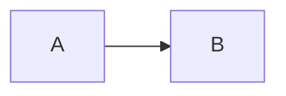

:smirk:
# This is h1 
## This is h2 
### This is h3
****
**This is strong**
这是tmd中文

*This is italic*
****
text...
****
$\lambda(x)=x^x$

$$
f(x)=g
$$

`int c=0;`

```c
int a,b;
```

  ```python
  import this
  class x:
      def __init__():
          pass
  ```


|  A  |  B  |
|-----|-----|
| a0  | b0  |
| a1  | b1  |

>This is reference